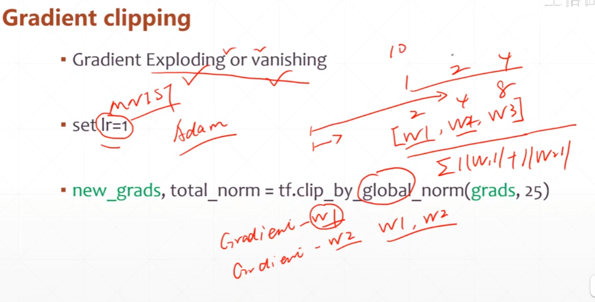

# 数据限幅

### clip_by_value

```python
a = tf.range(10)
tf.maximum(a,2)#数据的下限 ，也就是说如果小于2则变为2
tf.minimum(a,8)#数据的上限
tf.clip_by_value(a,2,8)#直接限定上下限
#<tf.Tensor: shape=(10,), dtype=int32, numpy=array([2, 2, 2, 3, 4, 5, 6, 7, 8, 8])>
```

### relu

约等于`tf.maximum(a,0)`

### clip_by_norm

在不改变方向的情况下，进行放缩

```python
a = tf.random.normal([2,2],mean=10)
tf.norm(a)#<tf.Tensor: shape=(), dtype=float32, numpy=20.50416>
aa =tf.clip_by_norm(a,15)
tf.norm(aa)#<tf.Tensor: shape=(), dtype=float32, numpy=15.000001>
```



实例：https://www.bilibili.com/video/BV1bv4y1P7nm?p=46