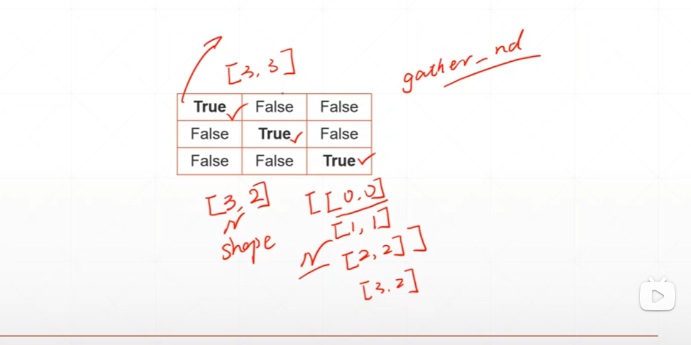
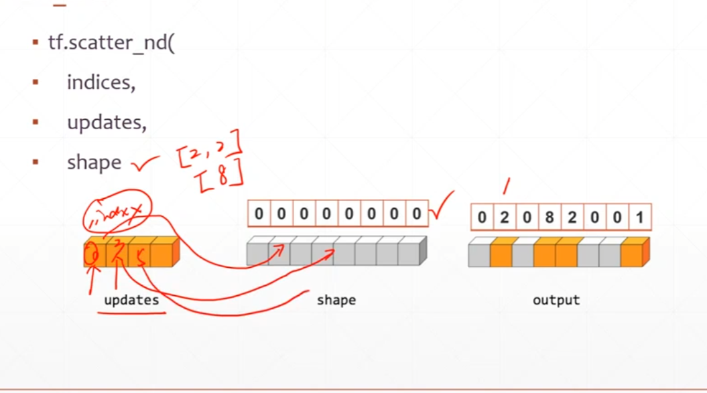
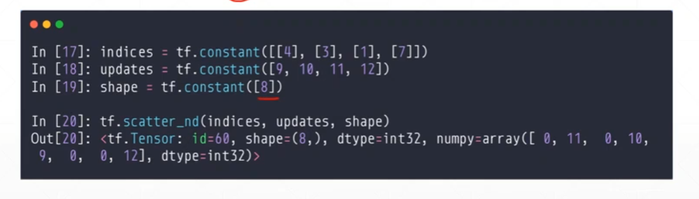
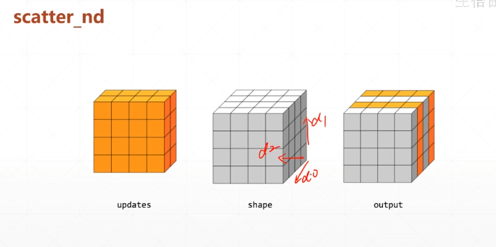

# 高阶op

### where

- `where(tensor)`

返回true元素所处位置的元素



```python
a = tf.random.normal([3,3])
mask = a >0
tf.boolean_mask(a,mask)#返回mask对应的数值
indices =  tf.where(mask)#返回mask中true的坐标
```

- `where(cond,A,B)`

```python
A = tf.ones([3,3])
B = tf.zeros([3,3])
tf.where(mask,A,B)#mask中ture的位置返回A的元素，False返回B
'''
<tf.Tensor: shape=(3, 3), dtype=float32, numpy=
array([[0., 1., 0.],
       [0., 0., 0.],
       [1., 1., 1.]], dtype=float32)>
'''
```

## scatter_nd

`scatter_nd(indices,updates,shape)`

创建一个shape的数据，根据indices，填充update的值







### meshgrid生成坐标轴

在numpy中我们使用`np.linspace`以及meshgrid构建，没有GPU加速

```py
y = tf.linspace(-2.,2,5)
x = tf.linspace(-2.,2,5)

points_x, points_y=tf.meshgrid(x,y)
points_x.shape#TensorShape([5, 5])
```

x,y的坐标对应的就保存在points_x，points_y中

```python
points = tf.stack([points_x,points_y],axis=2)
points.shape#TensorShape([5, 5, 2])
'''
array([[[-2., -2.],
        [-1., -2.],
        [ 0., -2.],
        [ 1., -2.],
        [ 2., -2.]],

       [[-2., -1.],
        [-1., -1.],
        [ 0., -1.],
        [ 1., -1.],
        [ 2., -1.]],
'''
```

常用于画决策边界，等高线

实例：画出`z=sin(x)+sin(y)`的等高线

```python
from numpy import dtype
import tensorflow as tf
from matplotlib import axis, pyplot as plt

def func(x):
    z = tf.math.sin(x[...,0])+tf.math.cos(x[...,1])
    return z

x = tf.linspace(0,2*4,500)
y = tf.linspace(0,2*4,500)

points_x,points_y = tf.meshgrid(x,y)
points = tf.stack([points_x,points_y],axis=2)

z = func(points)

plt.figure(figsize=(15,7))
plt.subplot(121)
plt.imshow(z,origin='lower',interpolation='none')
plt.colorbar()

plt.subplot(122)
plt.contour(points_x,points_y,z)
plt.colorbar()
plt.show()
```

