## 1. 卷积

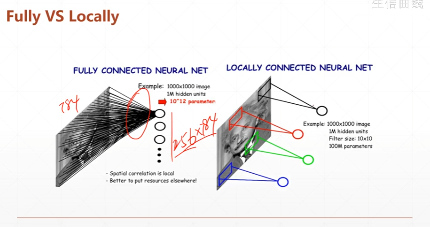

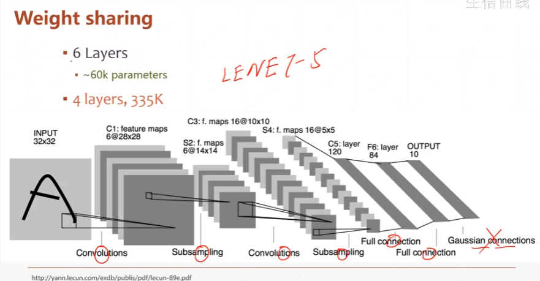

https://www.bilibili.com/video/BV1bv4y1P7nm?p=94

### 计算过程

- 卷积+滑动窗口

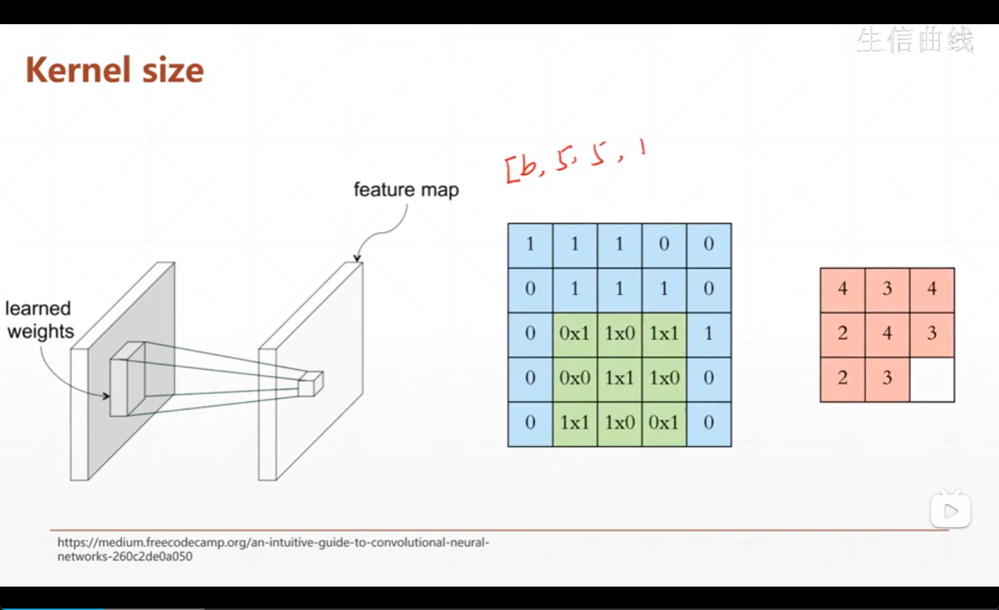

- 通过不同的卷积核，得到不同的特征图

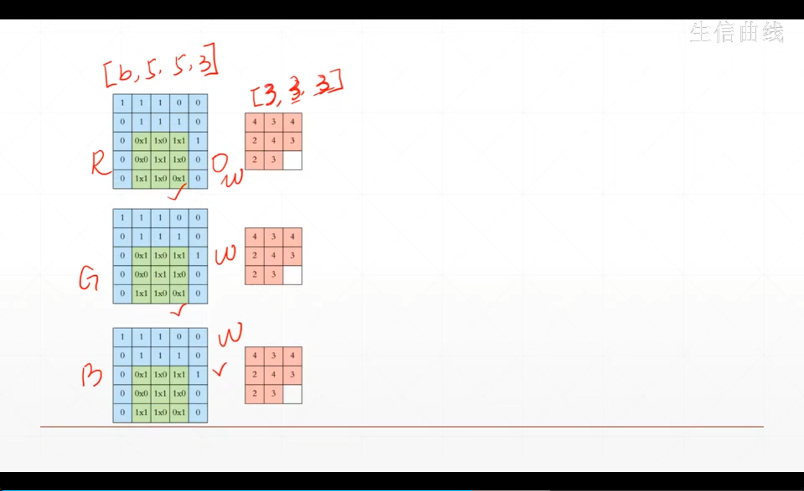

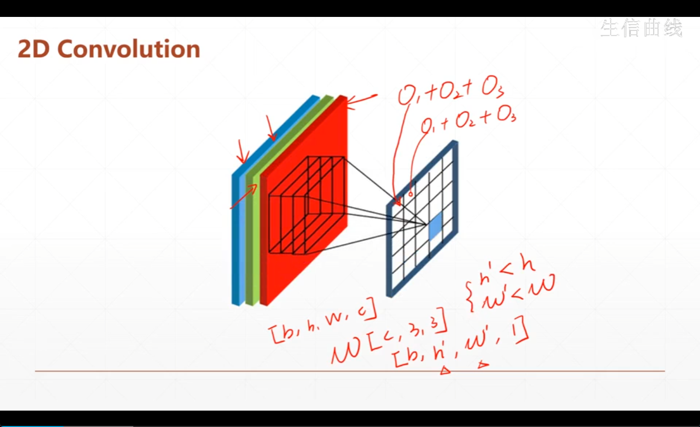

- padding，stride

通过增加边框或调整步长调整特征图的大小

- 个数

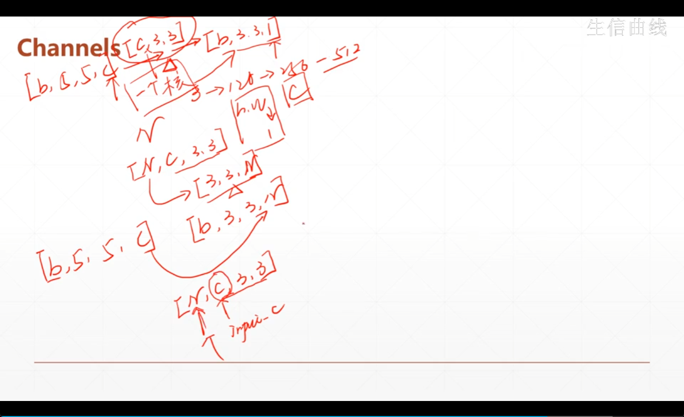

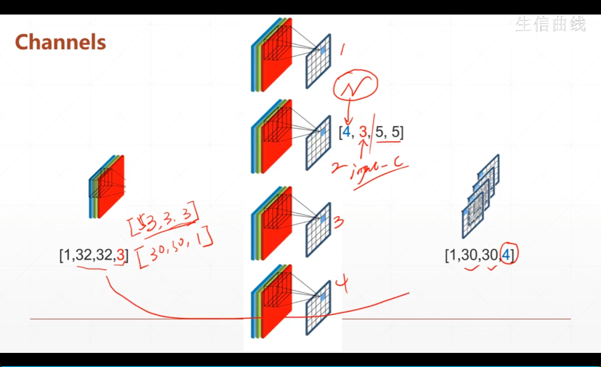

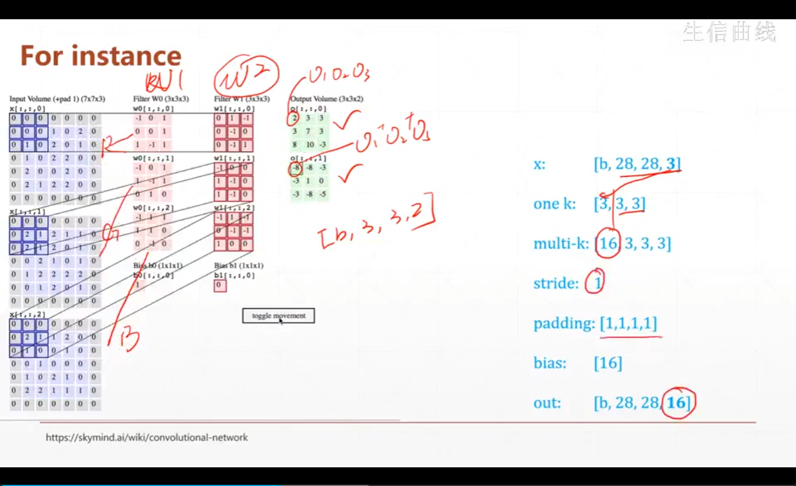

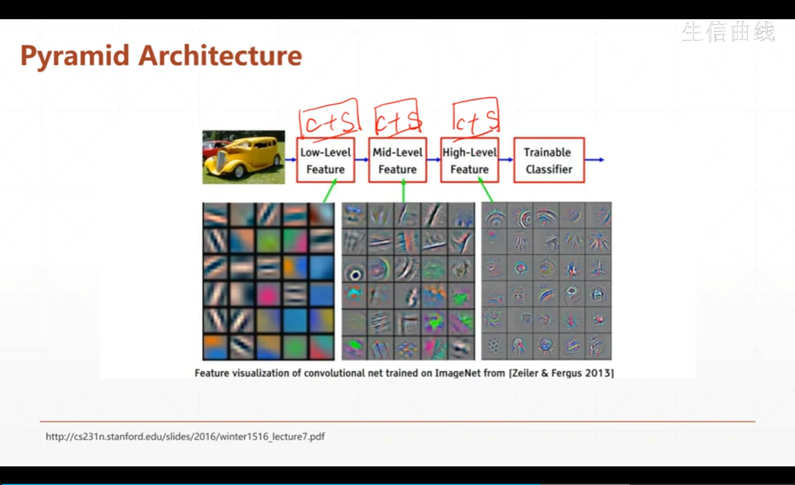

### 如何构建

```python
layer = tf.keras.layers.Conv2D(4,kernel_size = 5 , strides =1 , padding = 'valid')
#4:卷积核个数  padding也可以为same
```

```python
layer.kernel#查看参数[5,5,3,4]
layer.bias#查看偏置值
```

```python
out= tf.nn.conv2d(x,w,strifes=1,passing='valid')
#x:输入，w为具体的参数矩阵
out = out + b 
```

### 梯度下降

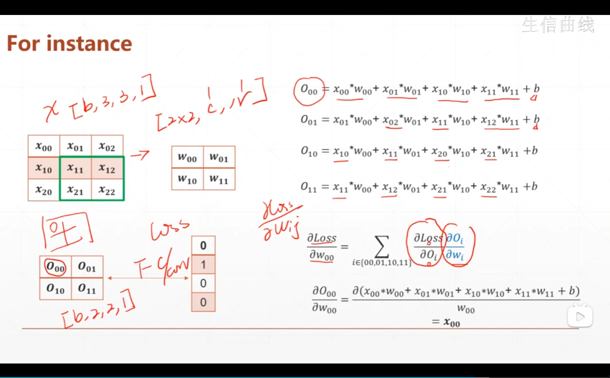

$O_{00}=x_{00}*w_{00}+x_{01}*w_{01}+x_{10}*w_{10}+x_{11}*w_{11}+b$

之后就是一个链式求导的过程

## 2. 池化和采样

### Subsampling

- max pooling
- avg pooling

同样也是使用滑动窗口，在特定的步长下进行化简

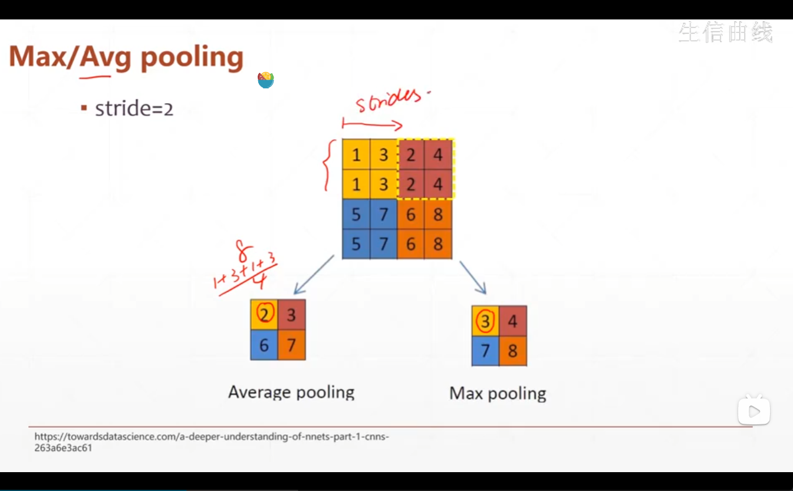

max pooling就是取区域内的最大值，avg就是取区域内的均值

strides可以使2也可以是1

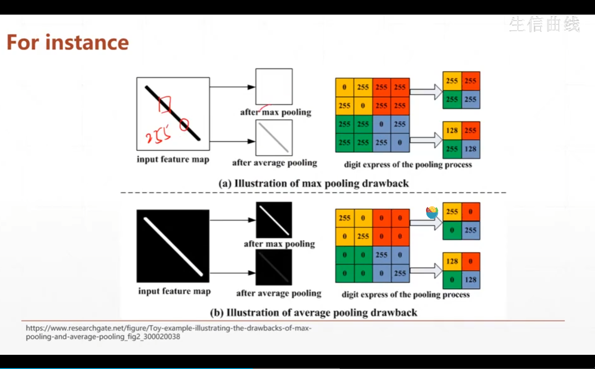

一般每次卷积之后都会有一个池化

```python
pool = tf.keras.layers.MaxPool2D(2,strides=2)
#2:kernel_size:2 , 
out = tf.nn.max_pool2d(x,2,strides = 2 , padding='valid')
```

### UpSampling

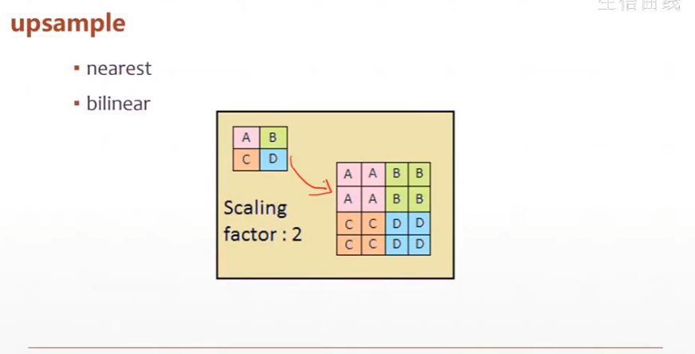

```py
layer = tf.keras.layers.UpSampling2D(size=3)
```

### Relu层

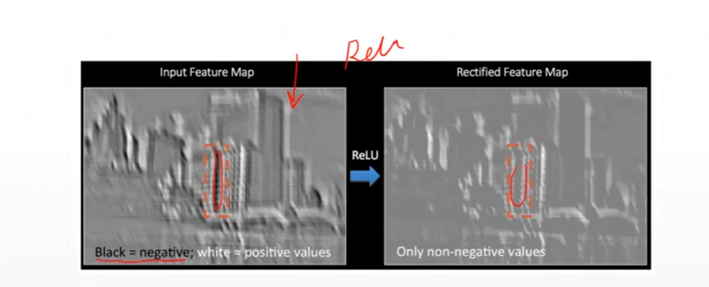

```python
tf.nn.relu(x)
tf.keras.layers.ReLU()(x)
```

## 3. 实战

cifar100---32*32---60K=50+10

**结构**

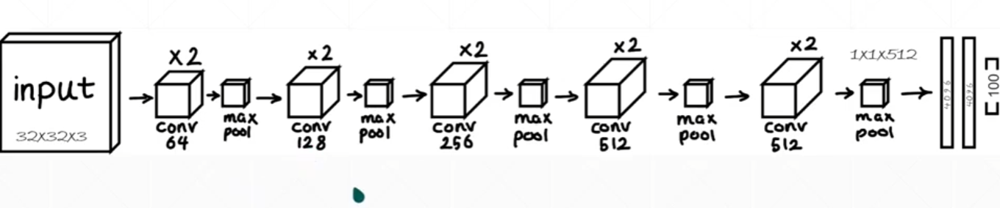

> 如何import keras
>
> ```python
> from keras import layers,optimizers,datasets,Sequential
> ```

https://blog.csdn.net/jialibang/article/details/108000356

> 问题   Loaded cuDNN version 8400 Could not locate zlibwapi.dll. Please make sure it is in your library path!
>
> https://blog.csdn.net/m0_51933492/article/details/124582359
>
> 注：需要重启

```python
from functools import reduce
import tensorflow as tf 
from keras import layers,optimizers,datasets,Sequential

tf.random.set_seed(2345)

conv_layers = [
    #unity 1
    layers.Conv2D(64,kernel_size=[3,3],padding='same',activation=tf.nn.relu),
    layers.Conv2D(64,kernel_size=[3,3],padding='same',activation=tf.nn.relu),
    layers.MaxPool2D(pool_size=[2,2],strides=2,padding='same'),
    
    #unity 2
    layers.Conv2D(128,kernel_size=[3,3],padding='same',activation=tf.nn.relu),
    layers.Conv2D(128,kernel_size=[3,3],padding='same',activation=tf.nn.relu),
    layers.MaxPool2D(pool_size=[2,2],strides=2,padding='same')  ,
    
    #unity 3
    layers.Conv2D(256,kernel_size=[3,3],padding='same',activation=tf.nn.relu),
    layers.Conv2D(256,kernel_size=[3,3],padding='same',activation=tf.nn.relu),
    layers.MaxPool2D(pool_size=[2,2],strides=2,padding='same') ,
    
    #unity 4
    layers.Conv2D(512,kernel_size=[3,3],padding='same',activation=tf.nn.relu),
    layers.Conv2D(512,kernel_size=[3,3],padding='same',activation=tf.nn.relu),
    layers.MaxPool2D(pool_size=[2,2],strides=2,padding='same') ,
    
    #unity 5
    layers.Conv2D(512,kernel_size=[3,3],padding='same',activation=tf.nn.relu),
    layers.Conv2D(512,kernel_size=[3,3],padding='same',activation=tf.nn.relu),
    layers.MaxPool2D(pool_size=[2,2],strides=2,padding='same') 
]

def preprocess(x,y):
    x = tf.cast(x,tf.float32)/255
    y = tf.cast(y,tf.int32)
    return x,y

def print_sample_shape(db):
    sample = next(iter(db))
    print(sample[0].shape,sample[1].shape)


def main():
    
    (x, y), (x_test, y_test) = datasets.cifar100.load_data()
    y =tf.squeeze(y , axis=1)
    y_test =tf.squeeze(y_test , axis=1)
    #(50000,32,32,3)  (10000,32,32,3)

    train_db = tf.data.Dataset.from_tensor_slices((x,y))
    train_db = train_db.shuffle(10000).map(preprocess).batch(64)

    test_db = tf.data.Dataset.from_tensor_slices((x_test,y_test))
    test_db = test_db.map(preprocess).batch(64)

    print_sample_shape(train_db)#(64, 32, 32, 3) (64,)
    
    conv_net = Sequential(conv_layers)
    conv_net.build(input_shape=[None,32,32,3])
    # x = tf.random.normal([4,32,32,3])# ==> (4, 1, 1, 512)
    # out = conv_net(x)
    # print(out.shape)
    
    fc_net = Sequential([
        layers.Dense(256,activation=tf.nn.relu),
        layers.Dense(128,activation=tf.nn.relu),
        layers.Dense(100,activation=None),
    ])
    
    conv_net.build(input_shape=[None,32,32,3])
    #(b, 1, 1, 512) == > (b , 512)
    fc_net.build(input_shape=[None,512])
    
    #优化器
    optimizer = optimizers.Adam(learning_rate=1e-4)
    #需要梯度的部分为conv+fc两部分
    variables = conv_net.trainable_variables  + fc_net.trainable_variables
    
    for epoch in range(50):
        for step , (x,y) in enumerate(train_db):
            
            with tf.GradientTape() as tape:
                out = conv_net(x)
                out = tf.reshape(out ,[-1,512])
                logits = fc_net(out)
                #[b] => b,100
                y_onehot = tf.one_hot(y,depth=100)
                loss = tf.losses.categorical_crossentropy(y_onehot,logits,from_logits=True)
                loss = tf.reduce_mean(loss)
                
            
            grads = tape.gradient(loss,variables)
            optimizer.apply_gradients(zip(grads,variables))
            
            if step %100 ==0:
                print(epoch, step , float(loss))
            
        total_num = 0
        total_correct = 0
        for x,y in test_db:
            out = conv_net(x)
            out = tf.reshape(out ,[-1,512])
            logits = fc_net(out)
            prob = tf.nn.softmax(logits,axis=1)
            pred = tf.argmax(prob,axis=1)
            pred = tf.cast(pred,tf.int32)
            correct = tf.cast(tf.equal(pred,y),tf.int32)
            correct = tf.reduce_sum(correct)
            total_num += x.shape[0]
            total_correct += int(correct)
        acc = total_correct/total_num
        print('*'*10)
        print(epoch,'accuracy:',acc)
        print('*'*10)
if __name__ == '__main__':
    main()
```

