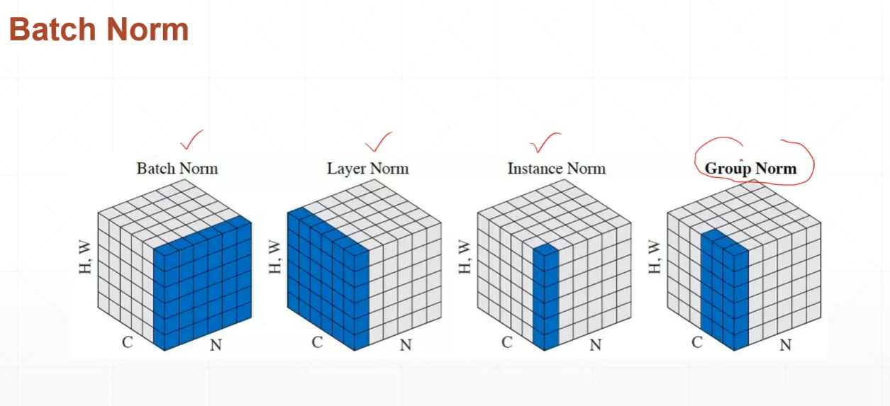
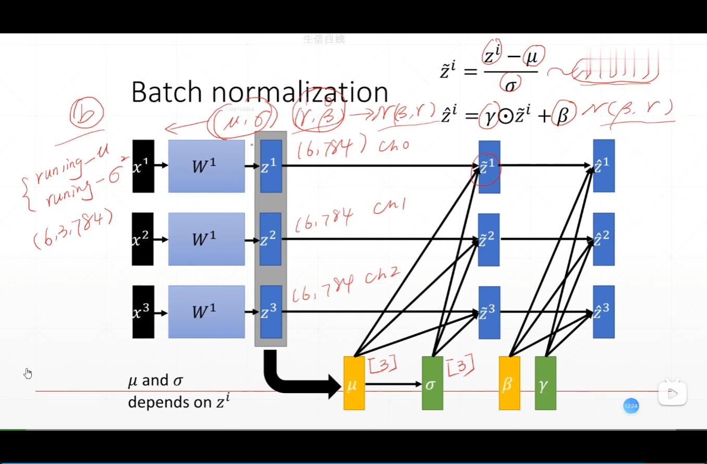
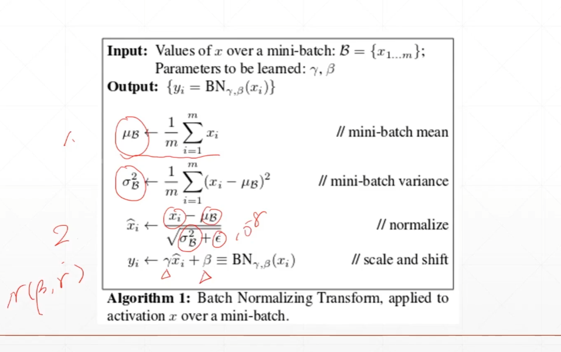
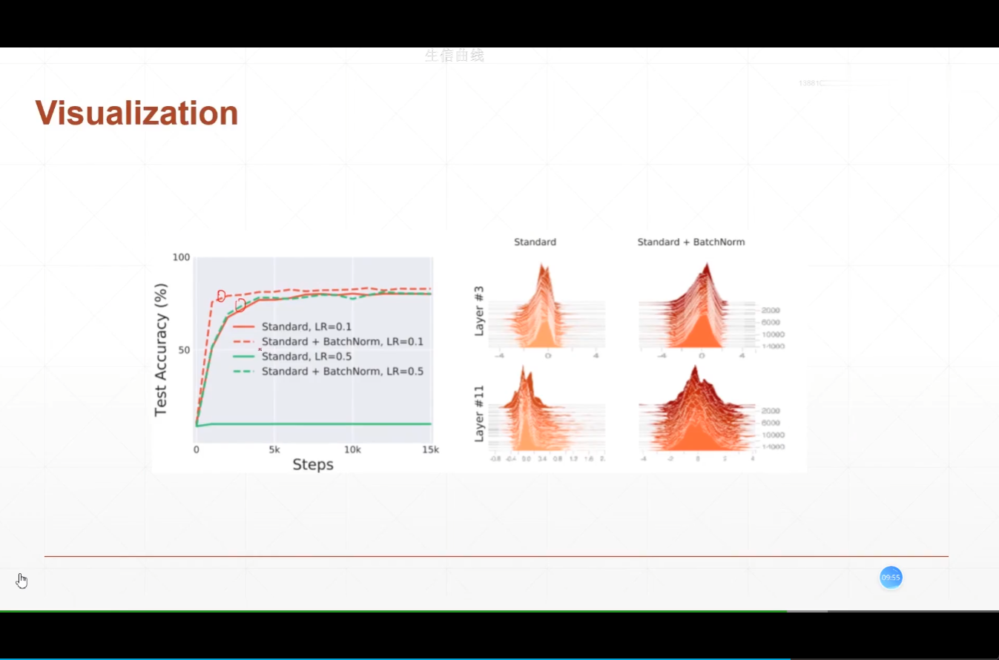

# 经典神经网络

## 1. LeNet-5


## 2. AlexNet


## 3. VGG


## 4. GoogLeNet


## feature scaling

https://zhuanlan.zhihu.com/p/24810318

```python
def normalize(x,mean,std):
    x = x -mean
    x = x / std
    return x 
```

- batch normalization
  - dynamic mean/std







```python
net = layers.BatchNormalization()
#axis=-1 center=True scale=True 是都进行缩放和平移  trainable=True
net(x,training=None)
'''
<tf.Tensor: shape=(2, 3), dtype=float32, numpy=
array([[ 0.3583169, -1.3122452, -1.2463319],
        [-1.2777916, -1.7581975, -0.5057919]], dtype=float32)>
'''

net.trainable_variables
'''
[<tf.Variable 'batch_normalization/gamma:0' shape=(3,) dtype=float32, numpy=array([1., 1., 1.], dtype=float32)>,
<tf.Variable 'batch_normalization/beta:0' shape=(3,) dtype=float32, numpy=array([0., 0., 0.], dtype=float32)>]
'''

net.variables
'''
[<tf.Variable 'batch_normalization/gamma:0' shape=(3,) dtype=float32, numpy=array([1., 1., 1.], dtype=float32)>,
 <tf.Variable 'batch_normalization/beta:0' shape=(3,) dtype=float32, numpy=array([0., 0., 0.], dtype=float32)>,
 <tf.Variable 'batch_normalization/moving_mean:0' shape=(3,) dtype=float32, numpy=array([0., 0., 0.], dtype=float32)>,
 <tf.Variable 'batch_normalization/moving_variance:0' shape=(3,) dtype=float32, numpy=array([1., 1., 1.], dtype=float32)>]
'''
```

```python
x = tf.random.normal([2,4,4,3],mean=-1,stddev=0.5)
net = layers.BatchNormalization(axis=3)
out = net(x,training=True)
net.variables
'''
[<tf.Variable 'batch_normalization_2/gamma:0' shape=(3,) dtype=float32, numpy=array([1., 1., 1.], dtype=float32)>,
 <tf.Variable 'batch_normalization_2/beta:0' shape=(3,) dtype=float32, numpy=array([0., 0., 0.], dtype=float32)>,
 <tf.Variable 'batch_normalization_2/moving_mean:0' shape=(3,) dtype=float32, numpy=array([-0.00855916, -0.01100943, -0.00956823], dtype=float32)>,
 <tf.Variable 'batch_normalization_2/moving_variance:0' shape=(3,) dtype=float32, numpy=array([0.99258375, 0.991314  , 0.9923488 ], dtype=float32)>]
'''
for i in range(100): out = net(x,training=True)

net.variables
'''
[<tf.Variable 'batch_normalization_1/gamma:0' shape=(3,) dtype=float32, numpy=array([1., 1., 1.], dtype=float32)>,
 <tf.Variable 'batch_normalization_1/beta:0' shape=(3,) dtype=float32, numpy=array([0., 0., 0.], dtype=float32)>,
 <tf.Variable 'batch_normalization_1/moving_mean:0' shape=(3,) dtype=float32, numpy=array([-0.6259307, -0.58605  , -0.6089093], dtype=float32)>,
 <tf.Variable 'batch_normalization_1/moving_variance:0' shape=(3,) dtype=float32, numpy=array([0.48389903, 0.50812393, 0.61608636], dtype=float32)>]
'''
```

**反向传播**

```python
for i in range(10):
    with tf.GradientTape() as tape:
        out = net(x,training=True)
        loss = tf.reduce_mean(tf.pow(out,2)) -1 
    grads = tape.gradient(loss,net.trainable_variables)
    optimizer.apply_gradients(zip(grads,net.trainable_variables))
```

