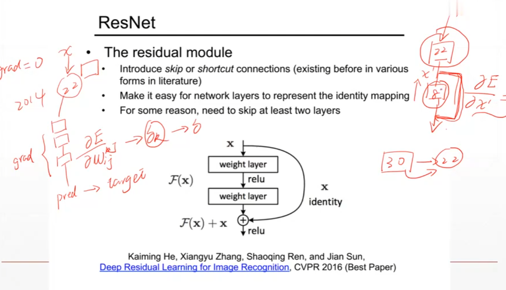
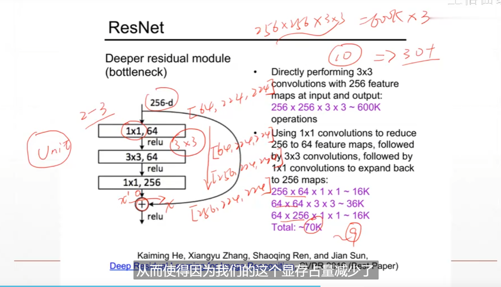
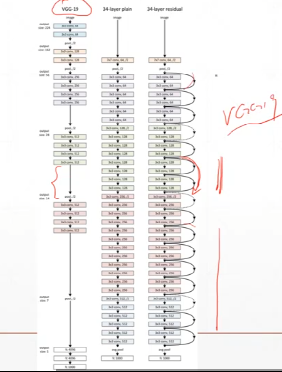
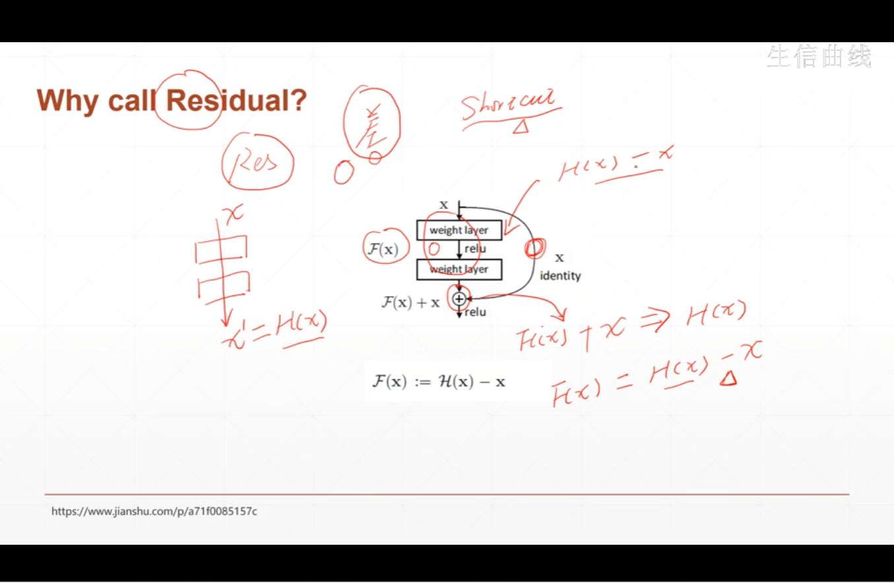
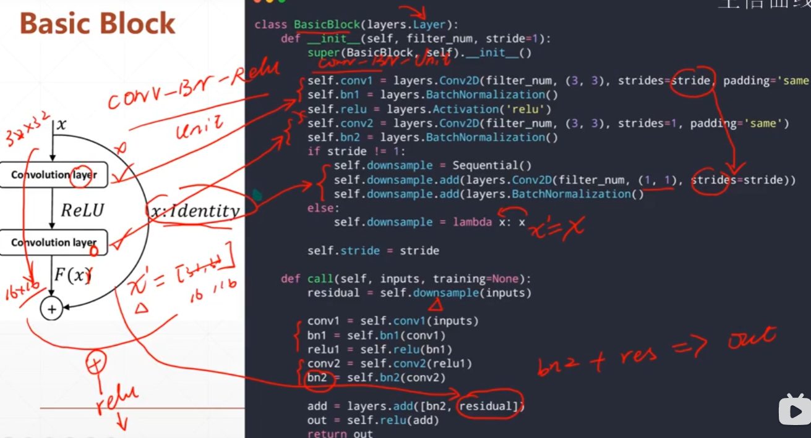
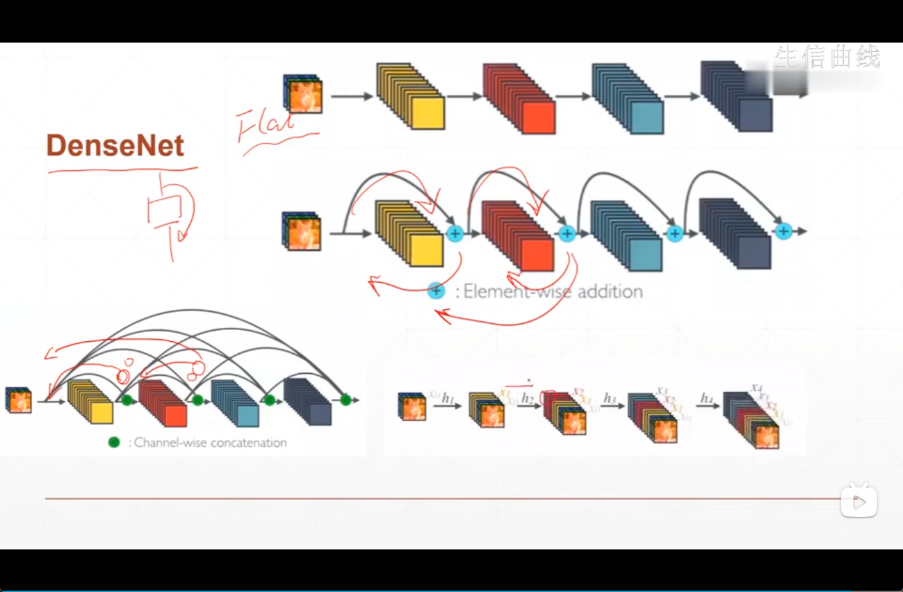

# ResNet









**代码实现**

```python
class BasicBlock(layers.Layer):
    def __init__(self,filter_num,stride = 1):
        self.conv1 = layers.Conv2D(filter_num,(3,3),strides=stride,padding='same')
        self.bn1 = layers.BatchNormalization()
        self.relu = layers.Activation('relu')
        self.conv2 = layers.Conv2D(filter_num,(3,3),strides = 1,padding='same')
        self.bn2 = layers.BatchNormalization()
        
        #此步就是短接层，目的就是让两者的特征图可以相加！！！！
        if stride != 1:
            self.downsample = Sequential()
            self.downsample.add(layers.Conv2D(filter_num,(1,1),strides=stride))
            self.downsample.add(layers.BatchNormalization())
        else:
            self.downsample = lambda x:x
        self.stride = stride
    def call(self,inputs,training=None):
        residual = self.downsample(inputs)
        conv1 = self.conv1(inputs)
        bn1 = self.bn1(conv1)
        relu = self.relu(bn1)
        conv2 = self.conv2(relu)
        bn2 = self.bn2(conv2)
        
        add = layers.add([bn2,residual])
        out = self.relu(add)
        return out
```



## 2. DenseNet



## 3. 实战

> ```python
> def conv2d(x, W):
>   return tf.nn.conv2d(x, W, strides=[1, 1, 1, 1], padding='SAME')
> ```
>
>   在学习tensorflow看到卷积这部分时，不明白这里的4个参数是什么意思，文档里面也没有具体说明。strides在官方定义中是一个一维具有四个元素的张量，其规定前后必须为1，所以我们可以改的是中间两个数，中间两个数分别代表了水平滑动和垂直滑动步长值。
>
>   在卷积核移动逐渐扫描整体图时候，因为步长的设置问题，可能导致剩下未扫描的空间不足以提供给卷积核的，大小扫描 比如有图大小为5*5,卷积核为2*2,步长为2,卷积核扫描了两次后，剩下一个元素，不够卷积核扫描了，这个时候就在后面补零，补完后满足卷积核的扫描，这种方式就是same。如果说把刚才不足以扫描的元素位置抛弃掉，就是valid方式。
