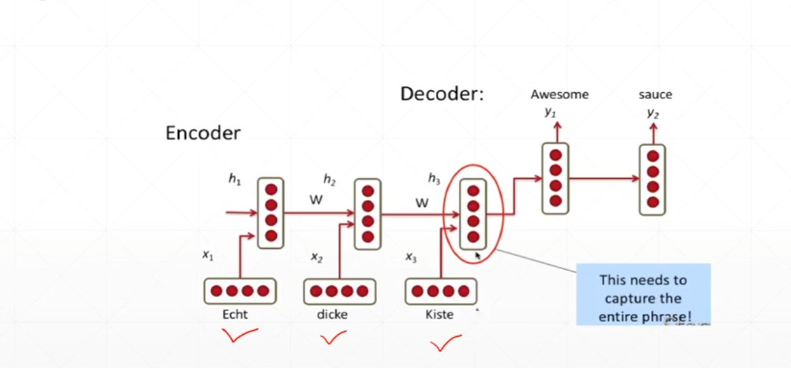
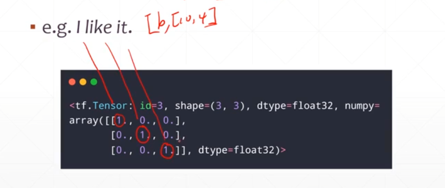
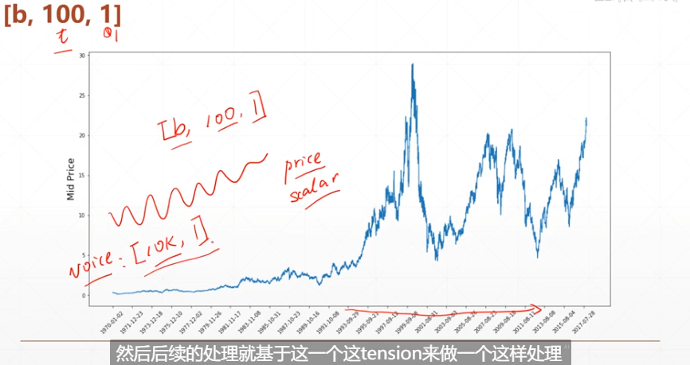
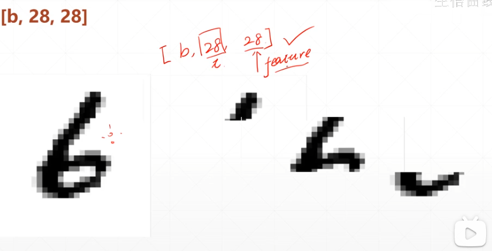
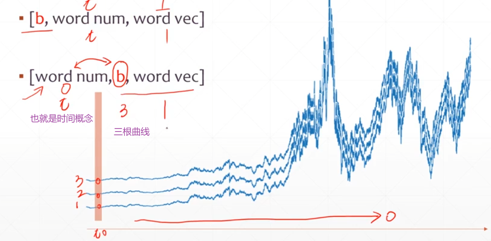
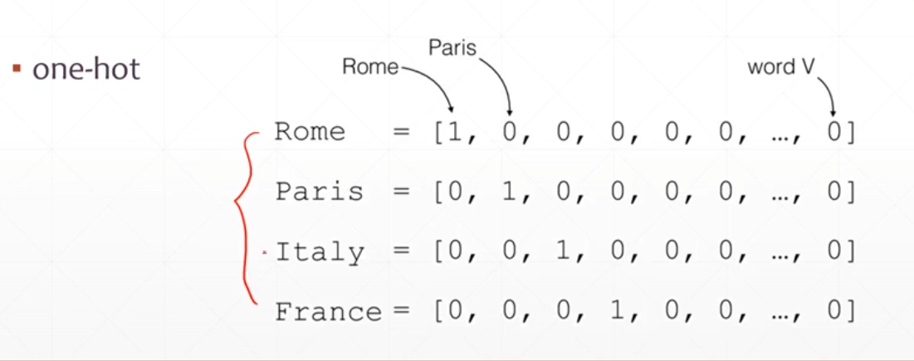
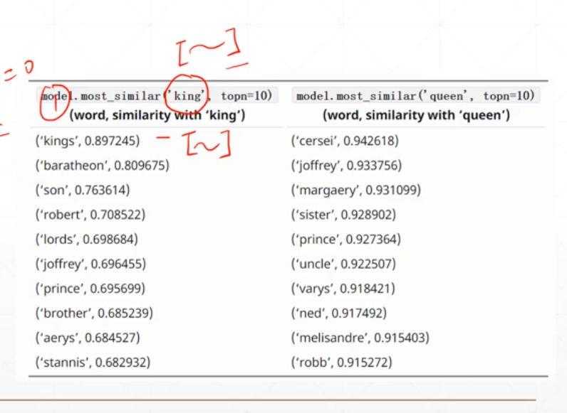
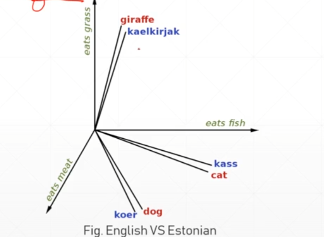

# 循环神经网络

在神经网络中加入时间概念，根据先后顺序不停的产生信号也就是temporal  signals，我们把这一系列信号成为Sequence



那么string类型转换为一个数值类型呢

- embedding===>`[b,seq_len,feature_len]`



股票和声音是同理的



图片也可以使用循环神经网络进行处理，可以按行进行扫描



### Batch

 

如下图所示，随着长方形推进进行输入输出

## 1. 如何代表一个文字[word,word vec]

- one-hot

比如在特定的地名中进行预测，那么只需要知道这些地名的组合就可以了如



- sparse---如果不是特定集合预测，那么使用onehot维度就太高了不适合使用

特性：1. 语意的相关性，在数字的方面也要有相关性  2.需要时可训练的 



常用的embeding

- word2Vec   ,   GloVe



**随机初始化一个embeding**

```python
x = tf.range(5)
x = tf.random.shuffle(x)
net = layers.Embedding(10,4)
net(x)

net.trainable
net.trainable_variables
'''
[
    <tf.Variable 'embedding_1/embeddings:0' shape=(10, 4) dtype=float32, numpy=
array([[-0.00846473, -0.0080054 ,  0.04330726,  0.02819163],
       [ 0.02759519,  0.04625995, -0.01390161, -0.01116551],
       [-0.02792153,  0.0037209 ,  0.00191154, -0.0343999 ],
       [ 0.01524012,  0.01349466,  0.00248134, -0.03261046],
       [-0.00709892,  0.03181444,  0.04227897, -0.03134799],
       [ 0.01699238, -0.01580092,  0.04253182, -0.01670089],
       [ 0.00311543,  0.00607613,  0.02316804,  0.03303372],
       [ 0.03263738, -0.03469551,  0.0284413 ,  0.04712102],
       [-0.01462201, -0.00703601, -0.04295194,  0.04951351],
       [ 0.04463675, -0.02328815, -0.02553723, -0.02978516]],
      dtype=float32)>
]
'''
```

