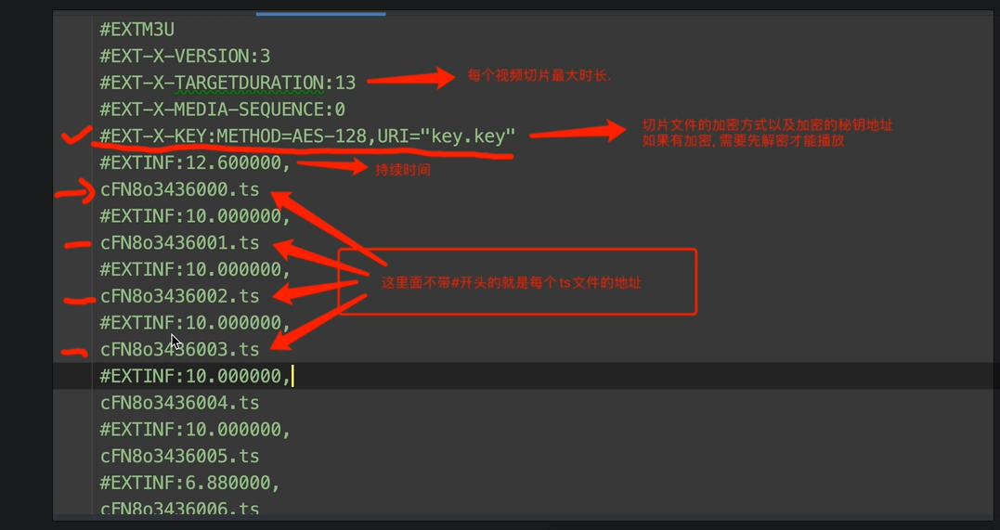

# 视频

- 视频过大
- 转码，切片，拉动进度条
- M3U8文件----视频播放顺序，视频存放路径



抓取过程：

1. 找到m3u8
2. 通过m3u8下载ts文件
3. 通过各种手段，将ts文件合并为一个mp4文件

## 1. 案例

网站失效

https://www.bilibili.com/video/BV1xY4y1B75G?p=71

**处理m3u8**

```python
with open('xxx.m3u8',mode='r',encoding='utf-8') as f:
    for line in f:
        line = line.strip()
        if line.startswith("#"):
            continue
        resp = requtsts.get(line)
        f = open(f"{n}.ts",mode='wb')
        f.write(xxxx)
        f.close()
```

https://www.bilibili.com/video/BV1xY4y1B75G?p=75