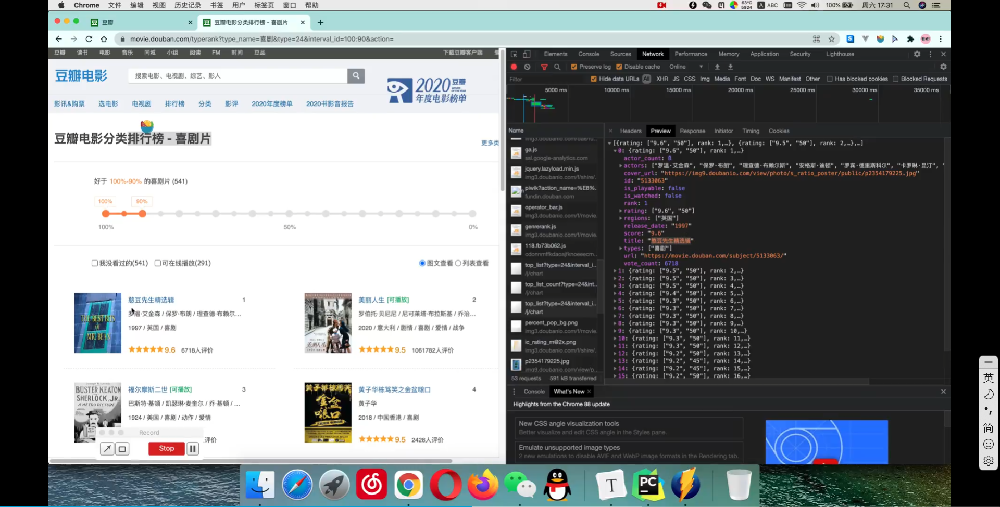
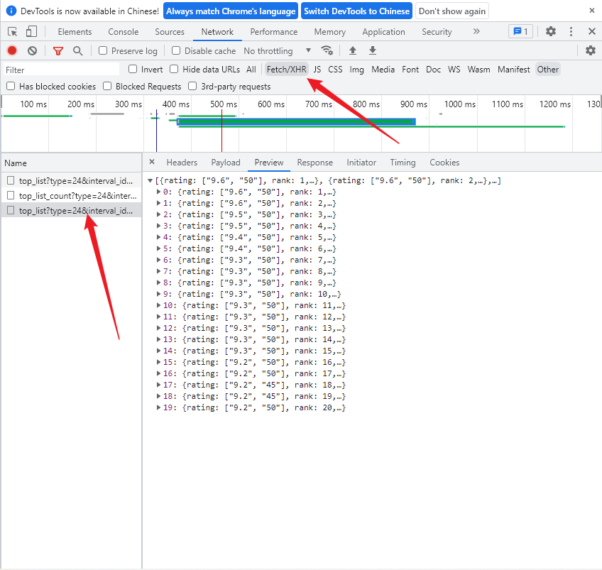

# web请求

- 服务器渲染：服务器直接把数据和html整合后同意返回浏览器，在源代码中看不到数据
- 客户端渲染：第一次请求只要一个html框架，第二次请求拿到数据，进行数据展示，在页面源代码中看不到数据

- 可以使用抓包工具来模拟请求



## http协议

请求：

- 请求行--请求方式
- 请求头--需要使用到的信息
- 请求体

响应：

- 状态行--协议，状态码
- 响应头
- 响应体

> 请求头中最常见的一些重要内容：
>
> 1. user-agent:请求载体的身份标识
> 2. referer:防盗链
> 3. cookie：本地字符串数据信息，用于登录和反爬token

## requests

```python
import requests as req

url = 'https://www.sogou.com/web?query=zhoujielun'
resp = req.get(url)
resp.text
```

但是因为检测到爬虫没有正常显示

将useragent添加到headers中

```python
import requests as req

url = 'https://www.sogou.com/web?query=zhoujielun'
headers = {
    "User-Agent":'Mozilla/5.0 (Windows NT 10.0; Win64; x64) AppleWebKit/537.36 (KHTML, like Gecko) Chrome/102.0.5005.62 Safari/537.36'
}
resp = req.get(url,headers=headers)
```

显示正常

百度翻译中可以通过sug来找到翻译，那如何处理post请求呢

**模拟post请求**

```python
url = 'https://fanyi.baidu.com/sug'

headers = {
    'User-Agent':'Mozilla/5.0 (Windows NT 10.0; Win64; x64) AppleWebKit/537.36 (KHTML, like Gecko) Chrome/102.0.5005.62 Safari/537.36'
}

s = input('输入想要输入的英文')
data = {'kw':s}

resp=req.post(url,data=data,headers=headers)
#将数据转化为字典
resp.json()
'''
{'errno': 0,
 'data': [{'k': 'dog', 'v': 'n. 狗; 蹩脚货; 丑女人; 卑鄙小人 v. 困扰; 跟踪'},
  {'k': 'DOG', 'v': 'abbr. Data Output Gate 数据输出门'},
  {'k': 'doge', 'v': 'n. 共和国总督'},
  {'k': 'dogm', 'v': 'abbr. dogmatic 教条的; 独断的; dogmatism 教条主义; dogmatist'},
  {'k': 'Dogo', 'v': '[地名] [马里、尼日尔、乍得] 多戈; [地名] [韩国] 道高'}]}
'''
```

## 获得二次请求信息

一般而此请求，也就是ajax中的请求一般都放在XHR中



```python
url = 'https://movie.douban.com/j/chart/top_list?type=24&interval_id=100%3A90&action=&start=0&limit=20'
#封装参数
param = {
    'type': '24',
    'interval_id' : '100:90',
    'action': '',
    'start': 0,
    'limit': 20
}

resp = req.get(url,params=param)
resp.text#''

#因为useragent没有获取到数据
url = 'https://movie.douban.com/j/chart/top_list?type=24&interval_id=100%3A90&action=&start=0&limit=20'
#封装参数
param = {
    'type': '24',
    'interval_id' : '100:90',
    'action': '',
    'start': 0,
    'limit': 20
}
headers = {
    'User-Agent': 'Mozilla/5.0 (Windows NT 10.0; Win64; x64) AppleWebKit/537.36 (KHTML, like Gecko) Chrome/102.0.5005.62 Safari/537.36'
}

resp = req.get(url,params=param,headers=headers)
resp.json()#获得数据
```

每次滚动时会发函俄国start参数子自动增加20，我们可以直接通过start模拟

> 使用完resp后需要close也就是`resp.close()`
>
> 