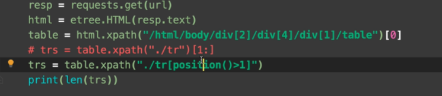

# 异步爬虫

同时爬取新发地的规格----使用线程池进行爬取



csv

https://blog.csdn.net/bryanwang_3099/article/details/119731390

```python
from cgi import print_arguments
from concurrent.futures import ProcessPoolExecutor, ThreadPoolExecutor
import requests
import csv
from threading import RLock

lock = RLock()

def download_one_page(url,num):
    headers = {
        'User-Agent': 'Mozilla/5.0 (Windows NT 10.0; Win64; x64) AppleWebKit/537.36 (KHTML, like Gecko) Chrome/102.0.5005.62 Safari/537.36'
    }
    data = {
        'limit': 20,
        'current': num
    }
    resp = requests.post(url,headers=headers,data=data)
    content = resp.json()['list']
    
    
    lock.acquire()
    #newline保证行之间没有空格
    with open('data.csv','a',encoding='utf-8',newline="") as f:
        writer = csv.writer(f)
        for i in range(20):
            writer.writerow([content[i]['prodName'],content[i]['lowPrice']])
    # for i in range(20):
    #     print(content[i]['prodName']+','+content[i]['lowPrice'])
    lock.release()
    print(f'{num}:over')
    
url = 'http://www.xinfadi.com.cn/getPriceData.html'

with ThreadPoolExecutor(50) as p :
    for i in range(1,1000):
        p.submit(download_one_page,url,i)
print('over')

```

## 1. 协程

```python
import asyncio
import time
async def func1():
    print("hello1 ")
    await asyncio.sleep(2)
    print('bye1 ')

async def func2():
    print("hello2 ")
    await asyncio.sleep(2)
    print('bye2 ')
    
async def func3():
    print("hello3 ")
    await asyncio.sleep(2)
    print('bye3 ')

async def func4():
    print("hello4 ")
    await asyncio.sleep(2)
    print('bye4 ')
    
# if __name__ == '__main__':
#     g = func()
#     asyncio.run(g)

f1 =func1()
f2 =func2()
f3 =func3()
f4 = func4()

tasks = [f1,f2,f3,f4]

asyncio.run(asyncio.wait(tasks))#同时启动多个任务
```

```python
import asyncio
import time
async def func1():
    print("hello1 ")
    await asyncio.sleep(2)
    print('bye1 ')

async def func2():
    print("hello2 ")
    await asyncio.sleep(2)
    print('bye2 ')
    
async def func3():
    print("hello3 ")
    await asyncio.sleep(2)
    print('bye3 ')

async def func4():
    print("hello4 ")
    await asyncio.sleep(2)
    print('bye4 ')
    
async def main():
    f1 =func1()
    f2 =func2()
    f3 =func3()
    f4 = func4()
    tasks = [f1,f2,f3,f4]
    await asyncio.wait(tasks)

asyncio.run(main())#同时启动多个任务
```

### 在爬虫中的应用

```python
import asyncio
import time

async def download(url):
    await asyncio.sleep(2)#requests.get()
    
async def main():
    urls = [
        'www.baidu.com',
        'www.bilibili.com'
    ]
    tasks = []
    for i in urls:
        tasks.append(asyncio.create_task(download(i))
        
    await asyncio.wait(tasks)
```

## 2. 异步http

异步的爬取图片

```python
import aiohttp
import asyncio


urls = [
    'https://kr.zutuanla.com/file/2021/0512/447c93953eb3676bd3a3ce0d7a85785c.jpg',
    'https://i1.shaodiyejin.com/uploads/tu/201608/15/08082497.jpg',
    'https://i1.shaodiyejin.com/uploads/tu/201608/15/08082603.jpg'
]

async def download(url):
    name = url.rsplit("/")[-1]
    #aiohttp.ClientSession()#和request模块差不多
    async with aiohttp.ClientSession() as session :
        async with session.get(url) as resp:
            with open(name,'wb') as f:#自学aiofile
                f.write(await resp.content.read()) # ==resp.content
    print(name,'ok')
async def main():
    tasks = []
    for url in urls:
        tasks.append(download(url))
    await asyncio.wait(tasks)
    
if __name__ =='__main__':
    asyncio.run(main())
```

https://www.bilibili.com/video/BV1xY4y1B75G?p=67
