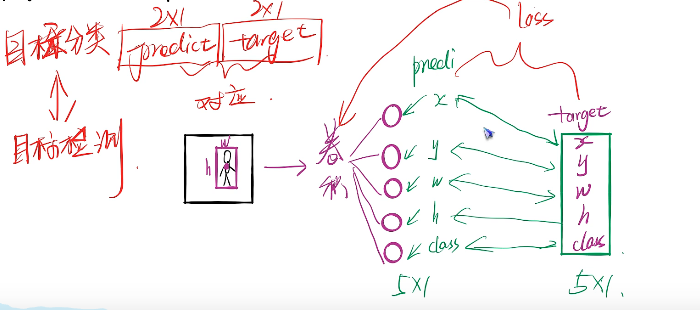
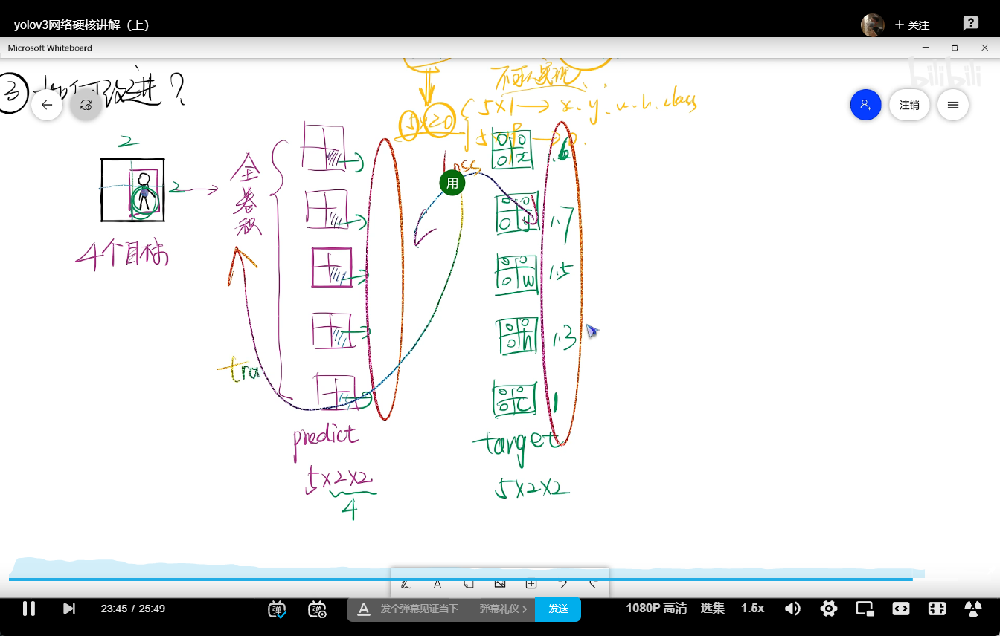
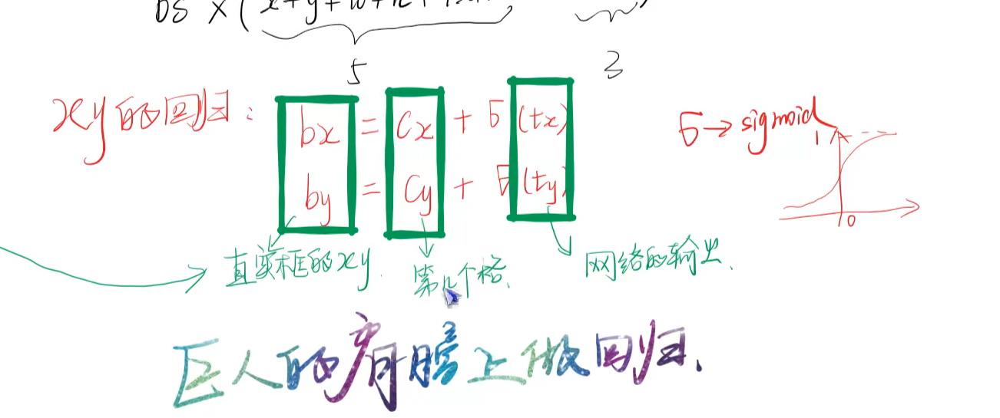

# 目标检测

- 目标分类-----prodict-target(2*1)
- 目标检测-----

为什么不能直接通过回归得到目标---单个目标还行，但是如果有多个目标就不太行了，所以直接让他输出多个框，得到多个目标

真实值如何便编码

https://www.bilibili.com/video/BV12y4y1v7L6?p=2&spm_id_from=pageDriver&vd_source=8beb74be6b19124f110600d2ce0f3957

## 2. 代码部分

