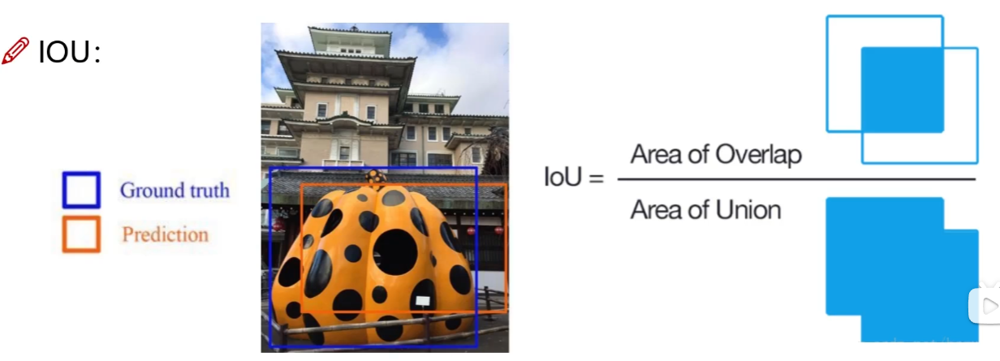
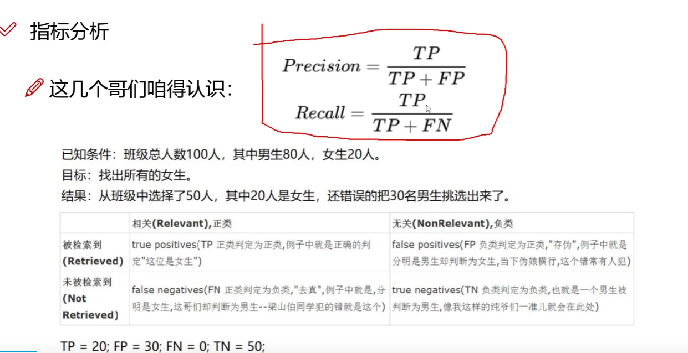
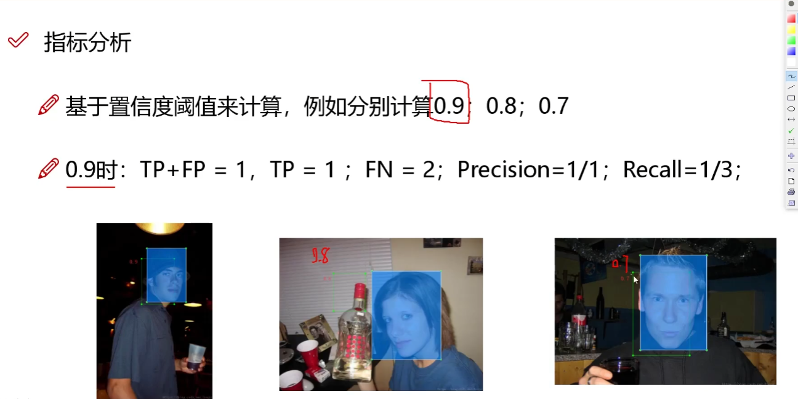
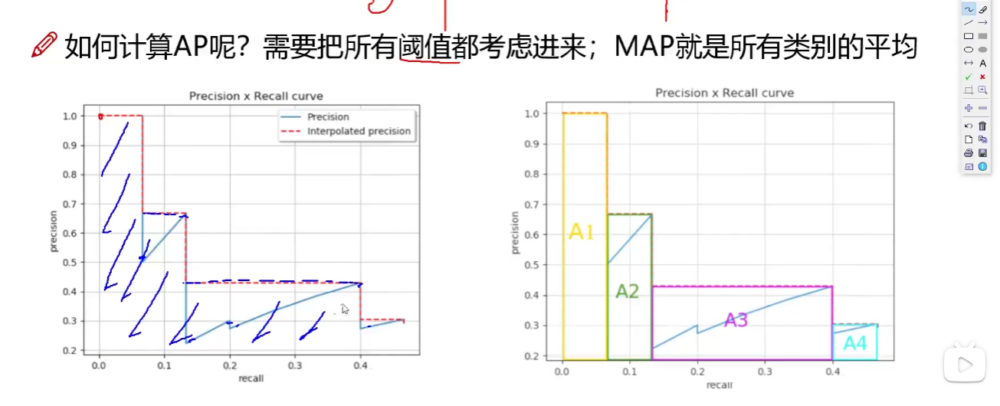

# 基本概念

目标检测算法主要分为两种：one-stage,two-stage

- two-stage : Faster-rcnn,Mask-Rcnn

速度慢----maskRcnn

- one-stage:YOLO

优点：速度快

### **指标分析**

- map指标：综合衡量检测效果
- IOU

### **在目标检测中精度和召回率**

置信度：检测到物体是目标的概率

### **MAP的计算**

map就是下方的面积

