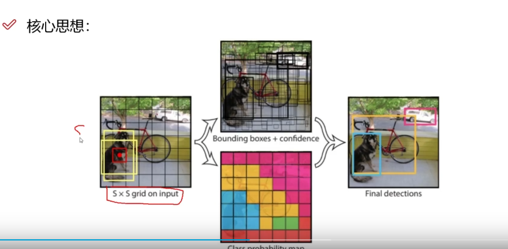
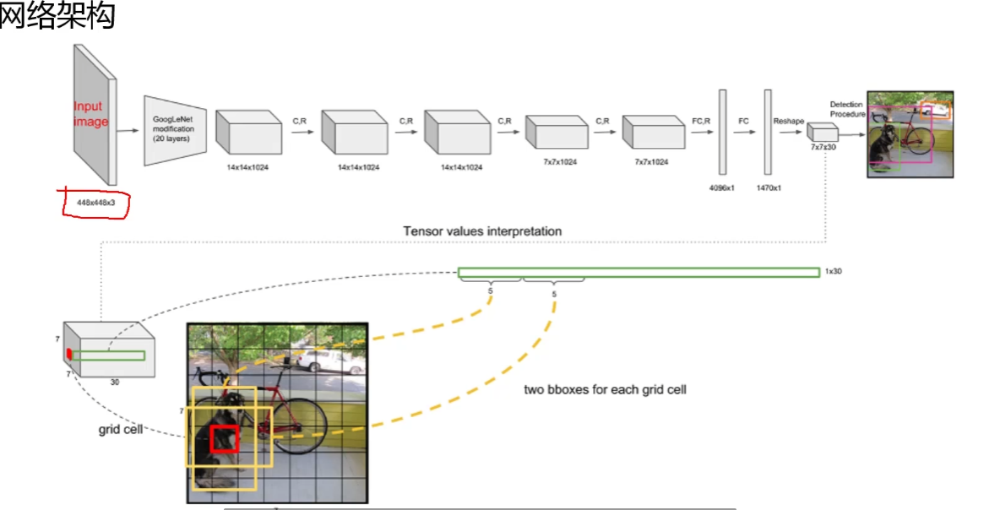
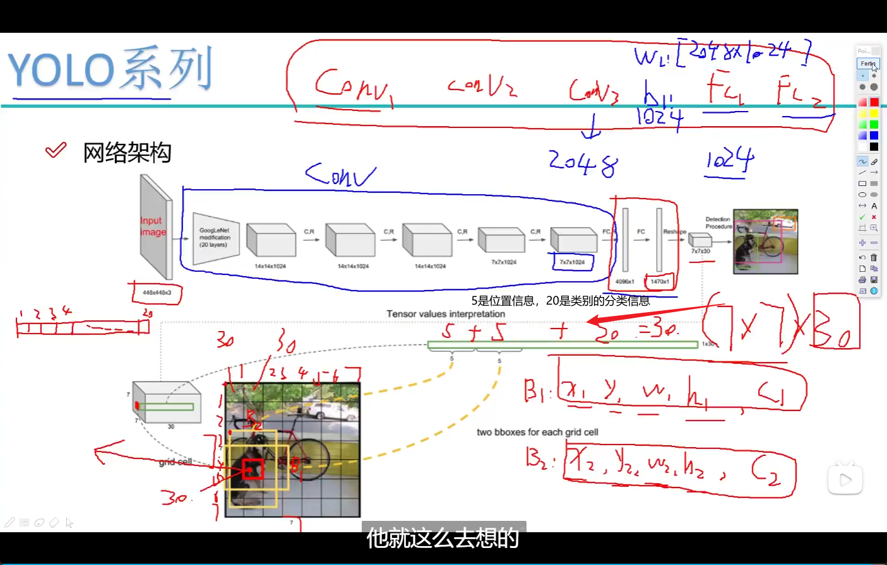
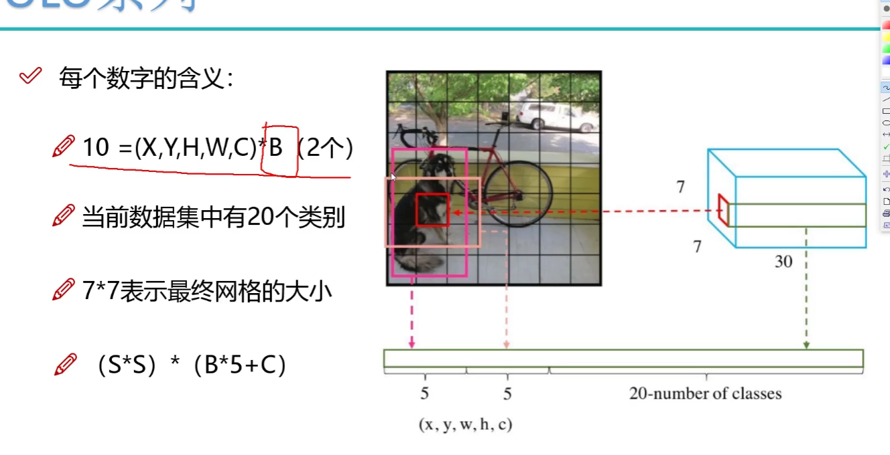
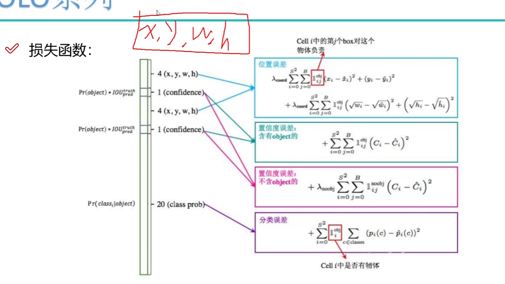
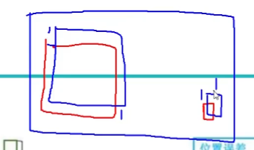
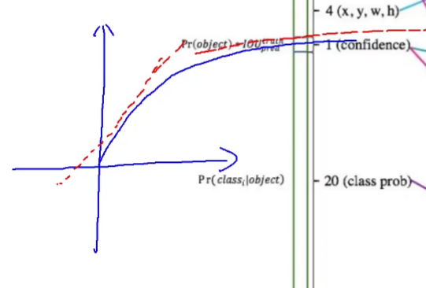
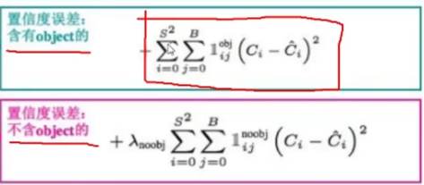
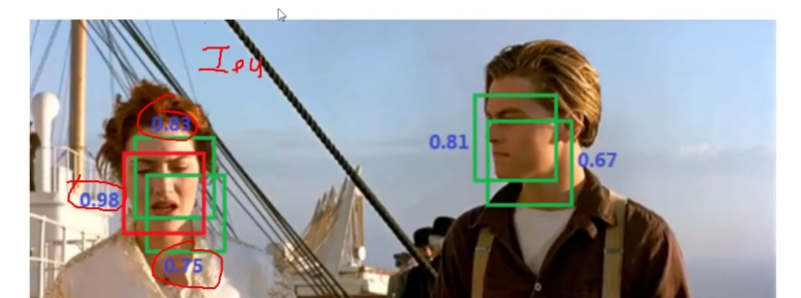

# 网络架构

- one-stage
- 检测问题转化为回归问题，CNN就可以了
- 对视频进行实时检测

每一个中心点给出两个候选框，不断调整x,y,h,w----一个回归任务

还有一个预测任务为置信度

## 1. 整体网络架构

## 2. 损失函数

- 为社么w,h在损失函数中有根号

对于较大物体来说，一个单位的w,h影响不大，但是同样一单位，对于较小物体来说，影响很大

因此我们需要更重视w，h较小的物体！！

loss函数类似下图所示：w,h较小时，影响较大，w,h较大时影响较小

- 置信度方面的函数

前景：1，后景：2，同时IOU要越大越好，

前景：如果两个候选框都重叠，那么选择IOU最大的那个

平衡背景占比

### NMS非极大值抑制

## 3. 问题

重合的东西很难检测，同一种物体不同品种难匹配，小物体检测不到

