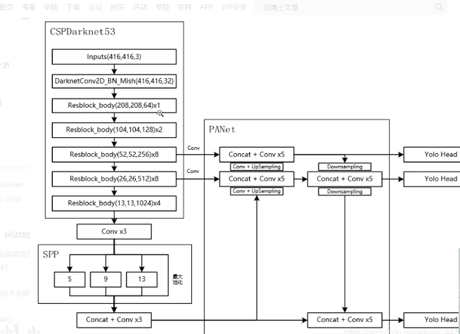
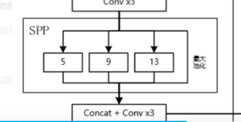
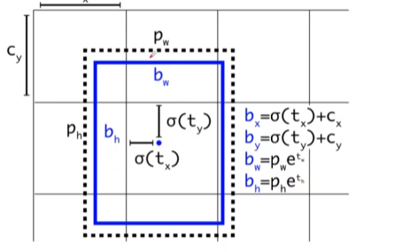
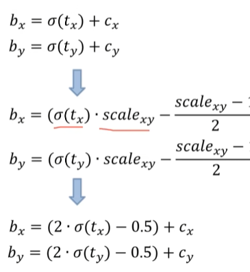
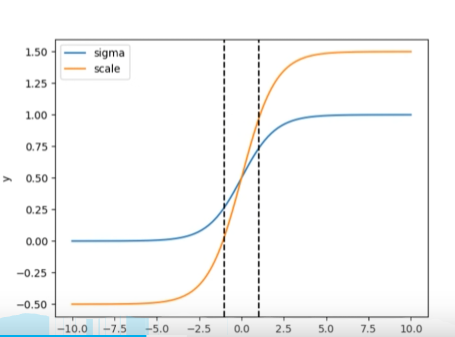
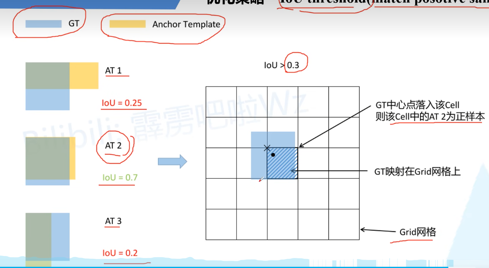
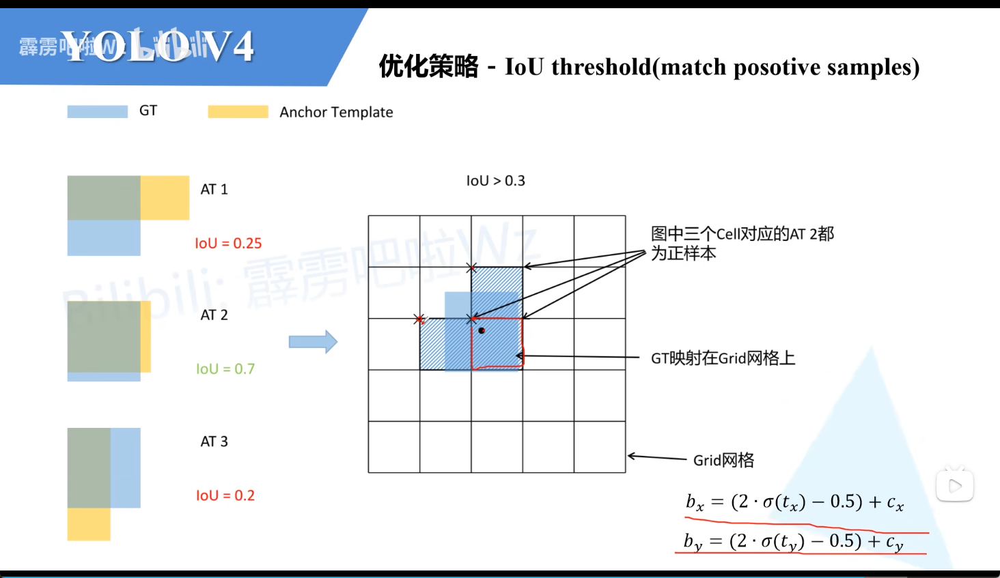
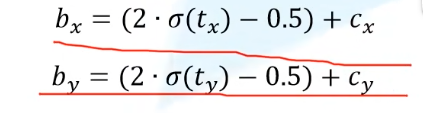
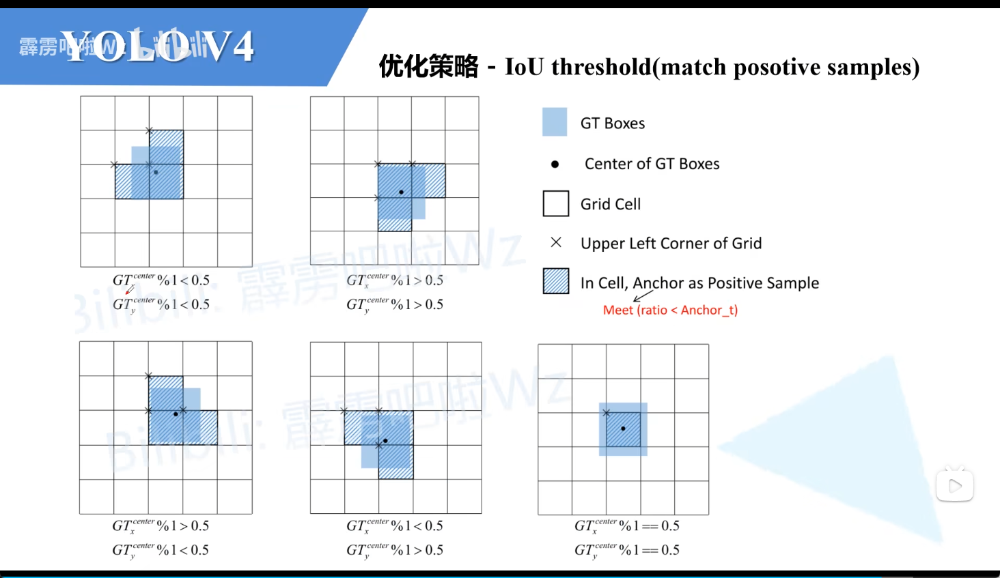

# YOLOv4

主要改进：

- 主干特征提取网络的改进 `Darknet53->CSPDarknet53`
- 加强特征提取网络使用了SPP和PANet结构
- 使用了Mosaic数据增强
- LOSS方面进行了改进

主体结构



CSPDarkNet的主要功能为压缩宽高，提升特征图的数量

最终要的shape为`13*13*1024`

在PANet中进行多次上下采样并进行多次融合

YOLOhead----`75=3*25`

## 1. CSPDarknet 53

1. 使用了Mish激活函数而不是Leaky

$$
Mish = x *tanh(ln(1+e^x))
$$

2. 使用了CSPnet结构


Mish激活函数

```python
class Mish(nn.Module):
    def __init__(self, **kwargs):
        super(Mish, self).__init__(**kwargs)
    def foward(self, x):
        return x*torch.tanh(F.softplus(x))
#也可以直接使用
torch.nn.function.mish()
```

基础的残差块

```python
# ===========================#
# 主干部分的卷积快
# ===========================#
class BasicConv(nn.Module):
    def __init__(self,in_channels,out_channels,kernel_size,strides=1) -> None:
        super(BasicConv,self).__init__()
        self.conv = nn.Conv2d(in_channels,out_channels,kernel_size,strides)
        self.bn = nn.BatchNorm2d(out_channels)
        self.activation = Mish()
    def forward(self,x):
        x = self.conv(x)
        x = self.bn(x)
        x = self.activation(x)
        return x
        
# ===========================#
# 主干部分残差块
# ===========================#

class ResBlock(nn.Module):
    #nn.Identity()就是输入什么就输出什么的占位模块
    def __init__(self,channels,hidden_channels=None,residual_activation=nn.Identity()):
        super(ResBlock,self).__init__()
        if hidden_channels is None:
            hidden_channels = channels
        self.block = nn.Sequential(
            BasicConv(channels,hidden_channels,1),
            BasicConv(hidden_channels,channels,3)
        )
        
    def forward(self,x):
        return x + self.block(x)
```

CSPNet的结构


**主干部分继续进行原来的残差块的堆叠**；
**另一部分则像一个残差边一样，经过少量处理直接连接到最后。**

具体过程

- 进行下采样
- 分为p1,p2

p1:

- 1*1卷积调整通道数

p2:

- 1*1卷积调整通道数
- 进行多次卷积

最后进行cat堆叠

注：下采样和cat都会使用卷积快

```python
# ===========================#
# 主干的模块
# ===========================#

'''
注意点：第一次之后一层卷积且图的储存不修改
输入：输入的通道数，输出的通道数，part2需要卷积的次数，是否是第一层（第一层的特征曾shape不变化）
'''
class ResBlock_body(nn.Module):
    def __init__(self,in_channels,out_channels,num_blocks,first=False) -> None:
        super(ResBlock_body,self).__init__()
        
        #卷积下采样
        self.downSample_conv = BasicConv(in_channels,out_channels,3,2)
        
        if first:
            #第一层只需要改变通道数不需要改变shape
            self.branch_conv0 = BasicConv(out_channels,out_channels,1)
            self.branch_conv1 = BasicConv(out_channels,out_channels,1)
            self.blcoks_conv = nn.Sequential(
                ResBlock(channels=out_channels,hidden_channels=out_channels//2),
                BasicConv(out_channels, out_channels, 1)
            )
            #注：这里进行了因为进行了堆叠所以需要*2
            self.concat_conv = BasicConv(out_channels*2, out_channels, 1)
        else:
            self.branch_conv0 = BasicConv(out_channels,out_channels//2,1)
            self.branch_conv1 = BasicConv(out_channels,out_channels//2,1)
            self.blcoks_conv = nn.Sequential(
                 *[ResBlock(out_channels//2) for _ in range(num_blocks)],
                BasicConv(out_channels//2, out_channels//2, 1)
            )
            self.concat_conv = BasicConv(out_channels, out_channels, 1)
            
    def forward(self,x):
        x = self.downSample_conv(x)
        
        x0 = self.branch_conv0(x)
        x1 = self.branch_conv1(x)
        x1= self.blcoks_conv(x1)
        x = torch.cat([x1,x0],dim=1)
        x = self.concat_conv(x)
        return x
    
text = torch.ones(1,32,416,416)
model = ResBlock_body(32,64,1,True)
print(model(text).shape)
```

主干网络：

只需要构建第一个卷积层个各个模块就可以了，最终由三个输出

```python
'''
输入每个模块需要卷积的次数就可以了
'''
class CSPDarkNet(nn.Module):
    def __init__(self, layers):
        super(CSPDarkNet, self).__init__()
        self.inplanes = 32
        self.conv1 = BasicConv(3, self.inplanes, kernel_size=3, strides=1)
        self.feature_channels = [64, 128, 256, 512, 1024]

        self.stages = nn.ModuleList([
            ResBlock_body(self.inplanes, self.feature_channels[0], layers[0], first=True),
            ResBlock_body(self.feature_channels[0], self.feature_channels[1], layers[1], first=False),
            ResBlock_body(self.feature_channels[1], self.feature_channels[2], layers[2], first=False),
            ResBlock_body(self.feature_channels[2], self.feature_channels[3], layers[3], first=False),
            ResBlock_body(self.feature_channels[3], self.feature_channels[4], layers[4], first=False)
        ])

        self.num_features = 1


    def forward(self, x):
        x = self.conv1(x)

        x = self.stages[0](x)
        x = self.stages[1](x)
        out3 = self.stages[2](x)
        out4 = self.stages[3](out3)
        out5 = self.stages[4](out4)

        return out3, out4, out5

def darknet53(**kwargs):
    model = CSPDarkNet([1, 2, 8, 8, 4])
    return model
```

## 2. SPP

通过不同大小的池化后进行堆叠就可以了



```python
class SpatialPyramidPooling(nn.Module):
    def __init__(self, pool_sizes=[5, 9, 13]):
        super(SpatialPyramidPooling, self).__init__()
        self.maxpools = nn.ModuleList([
            # padding为pool_size//2保证了输出的size不变
            nn.MaxPool2d(pool_size,1,pool_size//2)  for pool_size in pool_sizes
        ])
    def forward(self,x):

        features = [maxpool(x) for maxpool in self.maxpools[::-1]]
        features = torch.cat(features+[x],dim=1)
        #有一个短接
        return features
        
```

注：

- 有三个最大池化
- 以及一个短接
- 前后都有一次卷积，但是第二次卷积前需要先将特征图合并！！

## PANet

进行多次上下采样以及特征融合

**上采样模块**

```python
class Upsample(nn.Module):
   def __init__(self,in_channels,out_channels):
      super(Upsample,self).__init__() 
      self.upsample =nn.Sequential(
          conv2d(in_channels,out_channels,1),
          nn.Upsample(scale_factor=2,mode='nearest') 
      )
      
   def forward(self,x):
      x = self.upsample(x)
      return x
```

注：下采样是通过卷积的方式实现的

**不同size的卷积快**

```python
#---------------------------------------------------#
#   三次卷积块
#---------------------------------------------------#
def make_three_conv(filters_list, in_filters):
    m = nn.Sequential(
        conv2d(in_filters, filters_list[0], 1),
        conv2d(filters_list[0], filters_list[1], 3),
        conv2d(filters_list[1], filters_list[0], 1),
    )
    return m

#---------------------------------------------------#
#   五次卷积块
#---------------------------------------------------#
# 5次卷积为3*3和1*1交替使用减少参量，加快迭代
def make_five_conv(filters_list, in_filters):
    m = nn.Sequential(
        conv2d(in_filters, filters_list[0], 1),
        conv2d(filters_list[0], filters_list[1], 3),
        conv2d(filters_list[1], filters_list[0], 1),
        conv2d(filters_list[0], filters_list[1], 3),
        conv2d(filters_list[1], filters_list[0], 1),
    )
    return m
```

**YOLOhead**

有两个卷积层：`3*3,1*1`

1*1的卷积仅仅是为了将输出变化为指定格式不用bn层和激活函数

## 3. 解码

解码过程见YOLO3和YOLO3 一样

## 4. 预测过程

- 输入原始图片的长宽
- 将图片转化为RGB形式
- 加入灰度条(`letterbox_image`),并进行归一化
- 放入网络中进行预测
- 得到结果进行解码
- 得到的结果进行堆叠并进行非极大值抑制
- 得到的结果因为加入了灰度条，所以需要进行转化
- 绘制预测框


## 5. 优化策略

V3的优化策略是将数值归一化到0-1内



V4的优化策略是



scale一般都是2



可以看到这样回归速度更快

## IOU优化策略，选定正样本

普通的IOU策略：只要中心点的框在cell中则选定哪个cell中IOU超过阈值的作为正样本



V4中的IOU策略



因为之前的优化策略



bx和by的取值范围在(-0.5,1.5)中只要，中心点落到对应范围的框都可以取得正样本

具体策略如下图


