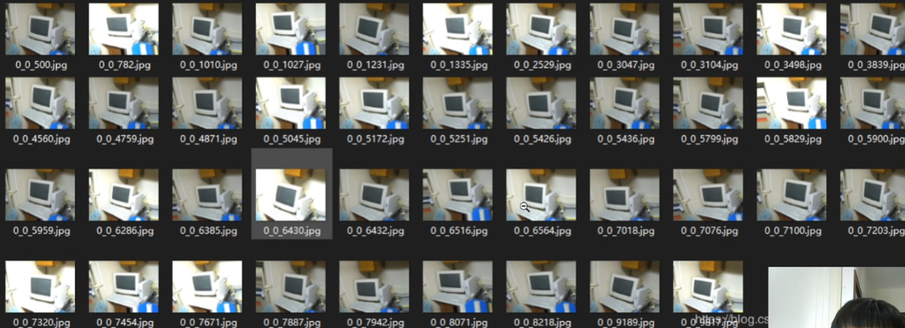

# 1. 数据增强

缓和由于角度亮度以及其他方面对预测的影响

目标检测中的数据增强不仅仅要改变图片，也要改变box的大小

## 2.自制项目

基础config设置：

- 图片路径
- 图像源目标框路径
- 图片的名称/随机及数量
- 使用的增强方法方法

mixup config设置

- 是否随机
- scale：缩放比例,(不用指定)
- jitter：宽高的扭曲比例---jitter代表原图片的宽高的扭曲比率，jitter=.3表示在0.7/1.3（0.538）到1.3/0.7（1.857）之间扭曲。
- hue,sat,val分别色调，饱和度，明度的扭曲