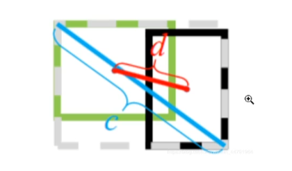

# CIOU

BBOX的回归损失优化和IOY优化不是完全等价的，普通IOU无法直接优化没有重叠的部分

CIOU将目标与anchor之间的距离，重叠率，尺度以及惩罚项都考虑进去了，不会初恋IOY和GIOU训练过程中发散等问题，而惩罚因子把预测框仓库按比拟合目标框的床宽鼻考虑进去
$$
CIOU=IOU-{\beta^2(b,b^{gt}) \over c^2}-\alpha v
$$

$\beta^2(b,b^{gt})$分别代表了预测框和真实框的中心点的欧式距离，c代表的是能能够包含预测框和真实框的最小闭包区域的对角线区域

$\alpha v$是惩罚因子
$$
\alpha = {v \over 1-IOU+v}
$$

$$
v={4 \over \pi}(arctan{w^{gt}\over h^{gt}}-arctan{w \over h})^2
$$

$v$真实框的宽高比和预测框的宽高比arctan之后的平方，作用是让两个框的宽高比趋向于一致

CIOU不能直接作为loss函数，我们需要做一些变换
$$
LOSS_{CIOU}= 1-IOU+{\beta^2(b,b^{gt}) \over c^2}+\alpha v
$$

> 非极大值抑制补充资料
>
> https://blog.csdn.net/weixin_44979150/article/details/122974977

