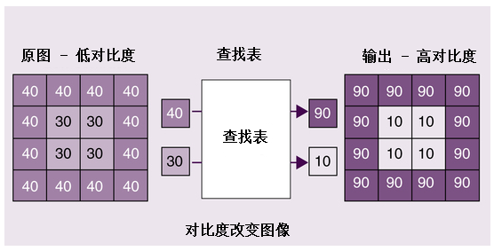
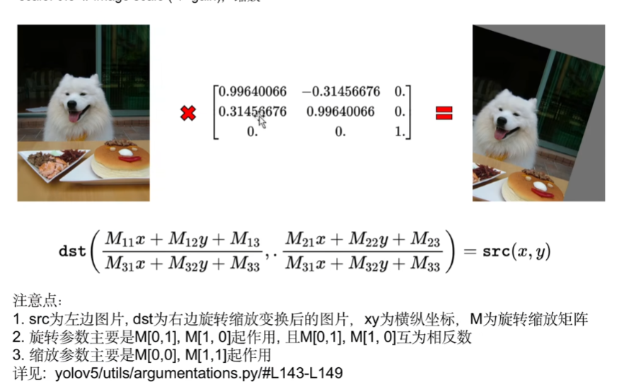
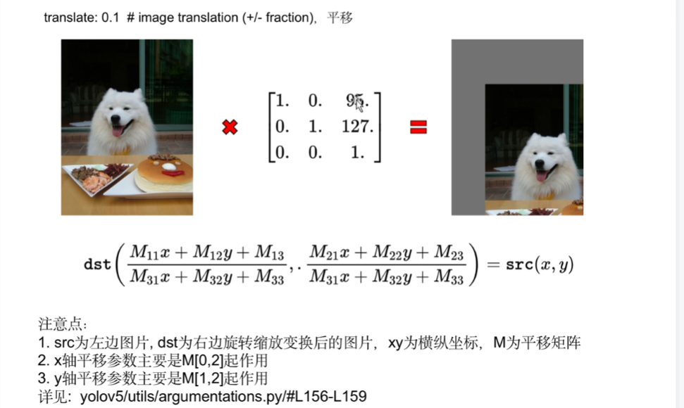
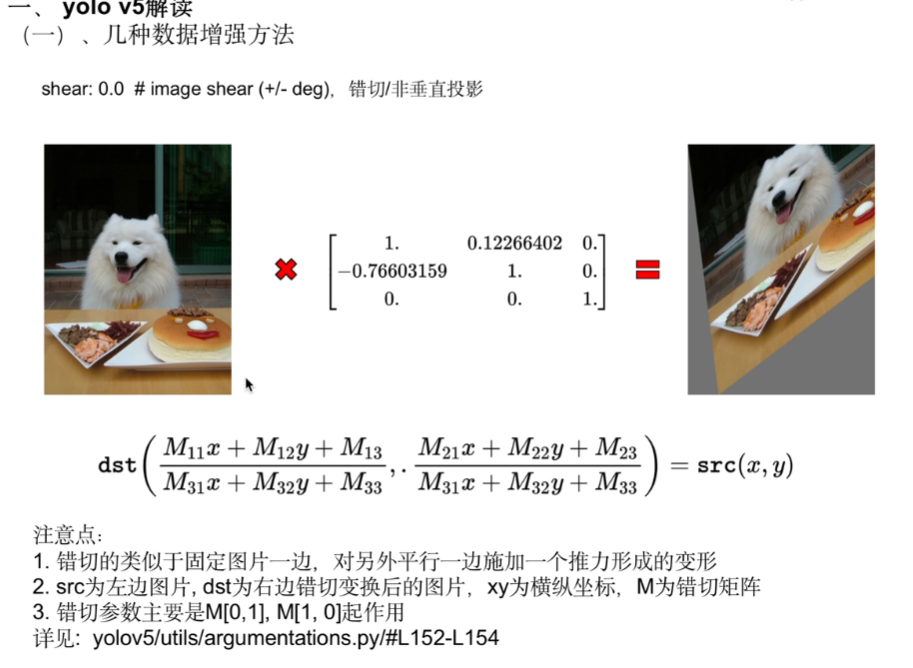
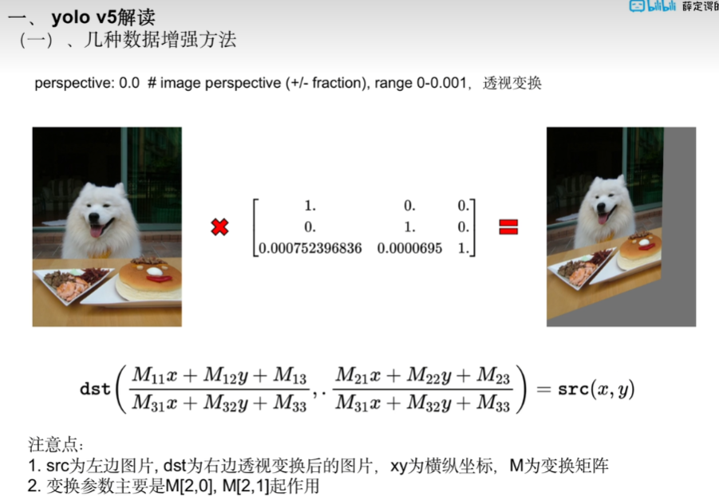
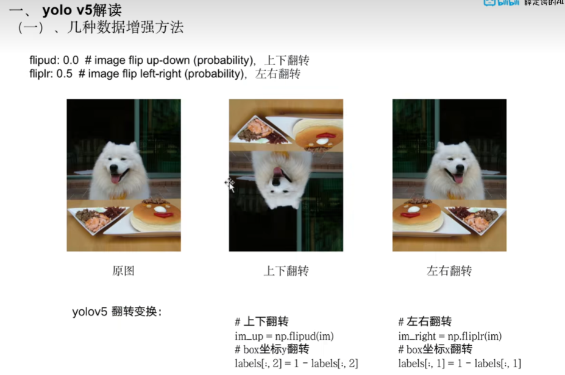
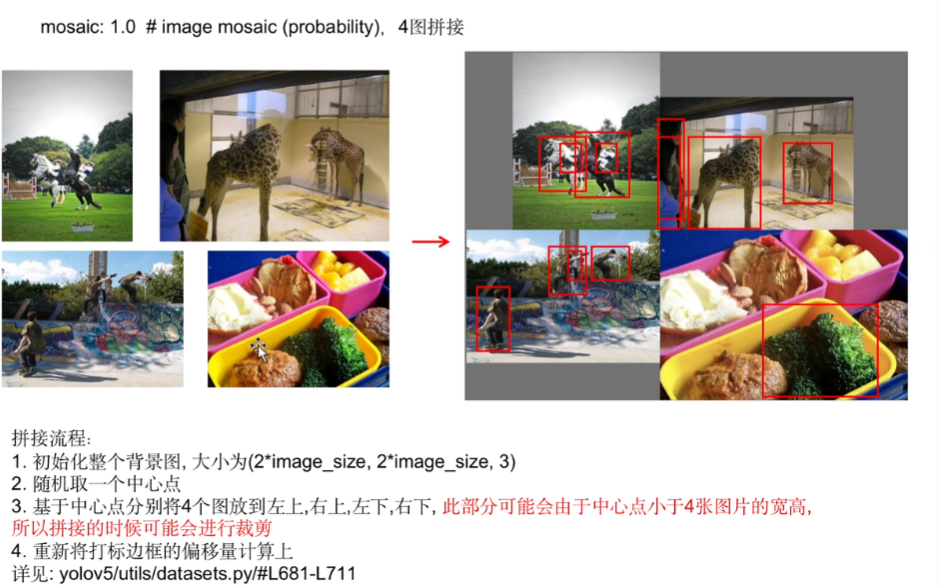
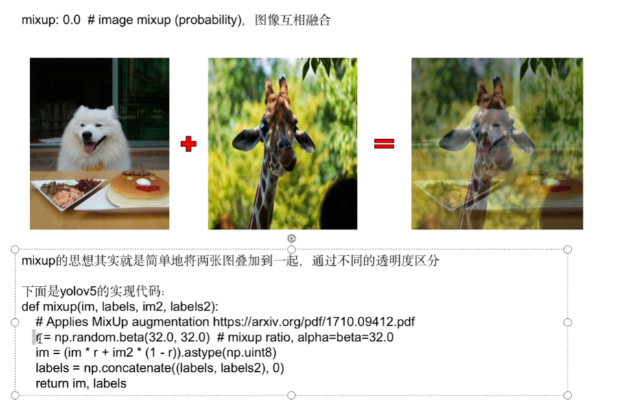
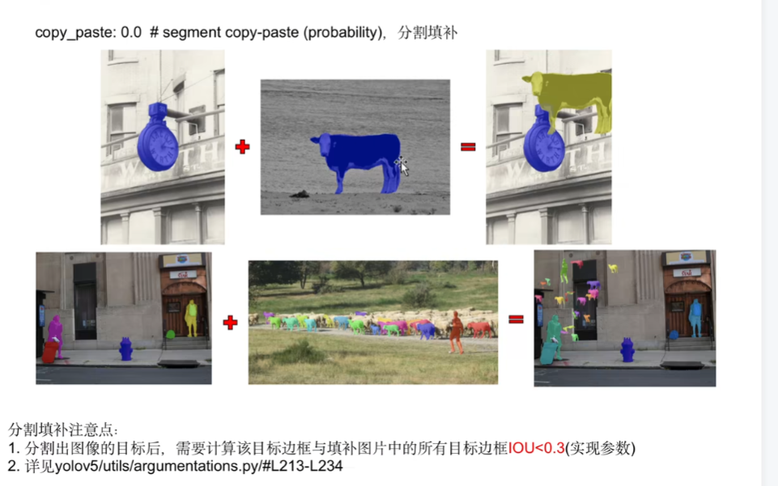

## rectangular：同一个batch里做rectangle宽高等比变换，减少黑边减少计算量


注：yolov5中每一个batch都是一个独立的inputshape，所以每个batch都会尽量的减少黑边

*****

## hsv变换

hsv_h:0.015 色调

hsv_s:0.7 饱和度

hsv_v:0.4 曝光度

我们通常使用opencv进行hsv变换


- 用到的函数

```python
cv2.LUT()
```

根据查找表来变换矩阵

https://shliang.blog.csdn.net/article/details/116064630

查找表：本质就是根据某个递增、递减或某种关系的函数，对像素值0-255这256个值进行计算，然后把计算的结果存储到一张表格中，当我们要对某张图片中的像素值进行颜色变换时，直接从查找表中找计算好的映射值，这种方法就非常快，当然很多类似的问题，也都是可以通过查找表这种方式去提高计算速度的！

颜色查找表一般用来对图像进行色彩变换
颜色查找表可以加快计算速度（因为查找表中的值是提前计算好的）
**查找表的样式**

```
array([ 0,  0,  0,  0,  0,  0,  1,  1,  1,  1,  1,  1,  2,  2,  2,  2,  2,
        2,  3,  3,  3,  3,  3,  3,  4,  4,  4,  4,  4,  5,  5,  5,  5,  5,
        5,  6,  6,  6,  6,  6,  6,  7,  7,  7,  7,  7,  7,  8,  8,  8,  8,
        8,  8,  9,  9,  9,  9,  9, 10, 10, 10, 10, 10, 10, 11, 11, 11, 11,
       11, 11, 12, 12, 12, 12, 12, 12, 13, 13, 13, 13, 13, 13, 14, 14, 14,
       14, 14, 15, 15, 15, 15, 15, 15, 16, 16, 16, 16, 16, 16, 17, 17, 17,
       17, 17, 17, 18, 18, 18, 18, 18, 19, 19, 19, 19, 19, 19, 20, 20, 20,
       20, 20, 20, 21, 21, 21, 21, 21, 21, 22, 22, 22, 22, 22, 22, 23, 23,
       23, 23, 23, 24, 24, 24, 24, 24, 24, 25, 25, 25, 25, 25, 25, 26, 26,
       26, 26, 26, 26, 27, 27, 27, 27, 27, 27, 28, 28, 28, 28, 28, 29, 29,
       29, 29, 29, 29, 30, 30, 30, 30, 30, 30, 31, 31, 31, 31, 31, 31, 32,
       32, 32, 32, 32, 32, 33, 33, 33, 33, 33, 34, 34, 34, 34, 34, 34, 35,
       35, 35, 35, 35, 35, 36, 36, 36, 36, 36, 36, 37, 37, 37, 37, 37, 38,
       38, 38, 38, 38, 38, 39, 39, 39, 39, 39, 39, 40, 40, 40, 40, 40, 40,
       41, 41, 41, 41, 41, 41, 42, 42, 42, 42, 42, 43, 43, 43, 43, 43, 43,
       44], dtype=uint8)
shape = (256,)
```

可以看到也就是根据序号将数值转化为表中的值



## 图片的平移，旋转等问题

主要通过变换矩阵来实现

### 旋转缩放



```python
degree = 45
scale = 0.5
h,w = im.shape[:2]

RS = np.eye(3)
angle = np.random.uniform(-degree,degree)#随机角度
random_scale = np.random.uniform(1-scale,1+scale)#随机尺度
RS[:2]=cv2.getRotationMatrix2D(angle=angle,center=(w//2,h//2),scale=random_scale)#如果angle为0则只会随机大小
# 将变换矩阵应用到图片里
rotate_scale = cv2.warpPerspective(im,RS,dsize=(w,h),borderValue=(114,114,114))
plt.figure(figsize=(10,20))
plt.subplot(121)
plt.imshow(im)
plt.title("origin")

plt.subplot(122)
plt.imshow(rotate_scale)
plt.title("rotate_scale")
plt.show()
```

## 图片的平移



```python
t = 0.1
h,w = im.shape[:2]

T = np.eye(3)
T[0,2] = np.random.uniform(0.5-t,0.5+t)*w*0.5
T[1,2] = np.random.uniform(0.5-t,0.5+t)*h*0.5
translate = cv2.warpPerspective(im,T,dsize=(w,h),borderValue=(114,114,114))

plt.figure(figsize=(10,20))
plt.subplot(121)
plt.imshow(im)
plt.subplot(122)
plt.imshow(translate)
plt.show()
```

## 错切，非垂直投影



```python
degree = 45
h,w,_ = im.shape
S = np.eye(3)
# 错切和旋转都是通过[0,1],[1,0]两个参数控制, 不同的是旋转两个参数互为相反数, 错切则不然
S[0, 1] = math.tan(random.uniform(-degree, degree) * math.pi / 180)
S[1, 0] = math.tan(random.uniform(-degree, degree) * math.pi / 180)

shear = cv2.warpPerspective(im, S, dsize=(w, h), borderValue=(114, 114, 114))

plt.figure(figsize=(10, 20)) 
plt.subplot(1,2,1)
plt.imshow(im)
plt.title("origin")

plt.subplot(1,2,2)
plt.imshow(shear)
plt.title("shear")
```

## 透视变换



## 翻转变换



## 马赛克拼接



```python
im_size=640
mosaic_border = [-im_size // 2, -im_size // 2]
labels4, segments4 = [], []
s = im_size
# 这里随机计算一个xy中心点
yc, xc = (int(random.uniform(-x, 2 * s + x)) for x in mosaic_border)  # mosaic center x, y
# indices = [index] + random.choices(self.indices, k=3)  # 3 additional image indices
# random.shuffle(indices)
im_files = [
    './tmp/t1.jpg',
    './tmp/t2.jpg',
    './tmp/t3.jpg',
    './tmp/t4.jpg',
]

img4 = np.full((s * 2, s * 2, 3), 114, dtype=np.uint8)
for i, file in enumerate(im_files):
    # Load image
    # img, _, (h, w) = load_image(self, index)
    img = cv2.imread(file)
    h, w, _ = np.shape(img)

    # place img in img4
    if i == 0:  # top left
        # base image with 4 tiles
        # 这里计算第一张图贴到左上角部分的一个 起点xy, 终点xy就是xc,yc
        x1a, y1a, x2a, y2a = max(xc - w, 0), max(yc - h, 0), xc, yc  # xmin, ymin, xmax, ymax (large image)
        # 计算主要是裁剪出要贴的图，避免越界了, 其实起点一般就是(0,0),如果上面xc<w,yc<h,这里就会被裁剪掉部分, 终点就是w,h
        x1b, y1b, x2b, y2b = w - (x2a - x1a), h - (y2a - y1a), w, h  # xmin, ymin, xmax, ymax (small image)
    elif i == 1:  # top right
        x1a, y1a, x2a, y2a = xc, max(yc - h, 0), min(xc + w, s * 2), yc
        x1b, y1b, x2b, y2b = 0, h - (y2a - y1a), min(w, x2a - x1a), h
    elif i == 2:  # bottom left
        x1a, y1a, x2a, y2a = max(xc - w, 0), yc, xc, min(s * 2, yc + h)
        x1b, y1b, x2b, y2b = w - (x2a - x1a), 0, w, min(y2a - y1a, h)
    elif i == 3:  # bottom right
        x1a, y1a, x2a, y2a = xc, yc, min(xc + w, s * 2), min(s * 2, yc + h)
        x1b, y1b, x2b, y2b = 0, 0, min(w, x2a - x1a), min(y2a - y1a, h)

    img4[y1a:y2a, x1a:x2a] = img[y1b:y2b, x1b:x2b]
    
    
plt.figure(figsize=(20, 100)) 
plt.subplot(1,5,1)
plt.imshow(plt.imread(im_files[0]))
plt.title("origin 1")

plt.subplot(1,5,2)
plt.imshow(plt.imread(im_files[1]))
plt.title("origin 2")

plt.subplot(1,5,3)
plt.imshow(plt.imread(im_files[2]))
plt.title("origin 3")

plt.subplot(1,5,4)
plt.imshow(plt.imread(im_files[3]))
plt.title("origin 4")

plt.subplot(1,5,5)
plt.imshow(img4[:,:,::-1])
plt.title("mosaic")
```

## Mixup



## 分割填补



例子

```python
from generate_coco_data import CoCoDataGenrator
from visual_ops import draw_instance

def bbox_iou(box1, box2, eps=1E-7):
    """ Returns the intersection over box2 area given box1, box2. Boxes are x1y1x2y2
    box1:       np.array of shape(4)
    box2:       np.array of shape(nx4)
    returns:    np.array of shape(n)
    """
    box2 = box2.transpose()
    # Get the coordinates of bounding boxes
    b1_x1, b1_y1, b1_x2, b1_y2 = box1[0], box1[1], box1[2], box1[3]
    b2_x1, b2_y1, b2_x2, b2_y2 = box2[0], box2[1], box2[2], box2[3]
    # Intersection area
    inter_area = (np.minimum(b1_x2, b2_x2) - np.maximum(b1_x1, b2_x1)).clip(0) * \
                 (np.minimum(b1_y2, b2_y2) - np.maximum(b1_y1, b2_y1)).clip(0)
    # box2 area
    box2_area = (b2_x2 - b2_x1) * (b2_y2 - b2_y1) + eps
    # Intersection over box2 area
    return inter_area / box2_area

def copy_paste(im_origin, boxes_origin, im_masks, masks, mask_boxes, p=1.):
    """ 分割填补,  https://arxiv.org/abs/2012.07177
    :param boxes_origin:  [[x1,y1,x2,y2], ....]
    :param masks: [h,w,instances]
    """

    out_boxes = []
    out_masks = []
    n = masks.shape[-1]
    im_new = im_origin.copy()
    if p and n:
        h, w, c = im_origin.shape  # height, width, channels
        for j in random.sample(range(n), k=round(p * n)):
            start_x = np.random.uniform(0, w // 2)
            start_y = np.random.uniform(0, h // 2)
            box, mask = mask_boxes[j], masks[:, :, j:j + 1]
            new_box = [
                int(start_x),
                int(start_y),
                int(min(start_x + (box[2] - box[0]), w)),
                int(min(start_y + (box[3] - box[1]), h))
            ]
            iou = bbox_iou(new_box, boxes_origin)
            if (iou < 0.90).all():
                mask_im = (im_masks * mask)[
                          box[1]:int((new_box[3] - new_box[1]) + box[1]),
                          box[0]:int((new_box[2] - new_box[0])) + box[0], :]
                new_mask_im = np.zeros(shape=(h, w, 3), dtype=int)
                new_mask_im[new_box[1]:new_box[3], new_box[0]:new_box[2], :] = mask_im
                # cv2.imshow("", np.array(new_mask_im, dtype=np.uint8))

                target_mask = mask[
                              box[1]:int((new_box[3] - new_box[1]) + box[1]),
                              box[0]:int((new_box[2] - new_box[0])) + box[0], :]
                new_mask = np.zeros(shape=(h, w, 1), dtype=int)
                new_mask[new_box[1]:new_box[3], new_box[0]:new_box[2], :] = target_mask
                out_boxes.append(new_box)
                out_masks.append(new_mask)

                im_new = im_new * (1 - new_mask) + new_mask_im * new_mask

    out_boxes = np.array(out_boxes)
    out_masks = np.concatenate(out_masks, axis=-1)
    im_new = np.array(im_new, dtype=np.uint8)
    return im_new, out_boxes, out_masks


file = "./instances_val2017.json"
coco = CoCoDataGenrator(
    coco_annotation_file=file,
    train_img_nums=2,
    include_mask=True,
    include_keypoint=False,
    batch_size=2)
data = coco.next_batch()
gt_imgs = data['imgs']
gt_boxes = data['bboxes']
gt_classes = data['labels']
gt_masks = data['masks']
valid_nums = data['valid_nums']
im_new, out_boxes, out_masks = copy_paste(
    im_origin=gt_imgs[0],
    boxes_origin=gt_boxes[0][:valid_nums[0]],
    im_masks=gt_imgs[1],
    masks=gt_masks[1][:, :, :valid_nums[1]],
    mask_boxes=gt_boxes[1][:valid_nums[1]])
final_masks = np.concatenate([gt_masks[0][:, :, :valid_nums[0]], out_masks], axis=-1)
im_new = draw_instance(im_new, final_masks)

img0 = gt_imgs[0]
img0 = draw_instance(img0, gt_masks[0][:, :, :valid_nums[0]])

img1 = gt_imgs[1]
img1 = draw_instance(img1, gt_masks[1][:, :, :valid_nums[1]])


plt.figure(figsize=(20, 60)) 
plt.subplot(1,3,1)
plt.imshow(img0)
plt.title("origin")

plt.subplot(1,3,2)
plt.imshow(img1)
plt.title("copy")

plt.subplot(1,3,3)
plt.imshow(im_new)
plt.title("paste")
```

