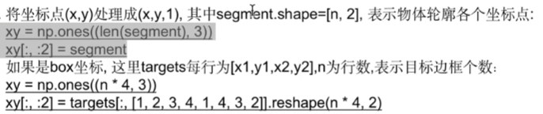
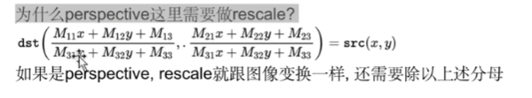

BOX坐标的缓缓

1. 将所有变换矩阵相乘得到最终的变换矩阵$M = T@S@R@P@C$
2.  
3. 将边框处理$xy=xy@M.T$
4. rescale操作，如果使用了透视变换，就需要rescale

​	$xy=xy[:,:2]/xy[:,2:3]$

没有进行透视操作

$xy = xy[:,:2]$

5. 价格坐标clip到[0,width],[0,height]区间中
6. 进一步过滤，留下w,h>2,宽高比<20，变换后面积比>0.1的xy、

