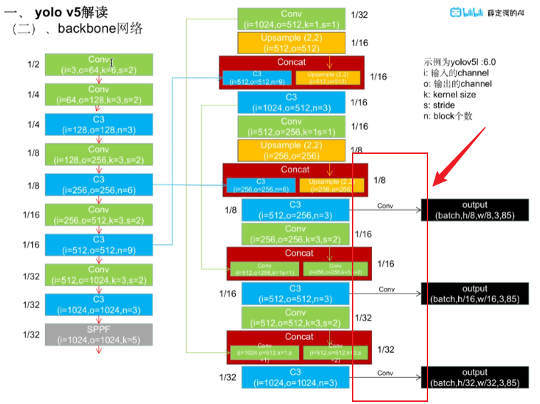

## 源码部分

### 读取配置信息，并根据配置进行结构修改

配置信息

```yaml
# YOLOv5 🚀 by Ultralytics, GPL-3.0 license

# Parameters
nc: 80  # number of classes
depth_multiple: 1.0  # model depth multiple
width_multiple: 1.0  # layer channel multiple
anchors:
  - [10,13, 16,30, 33,23]  # P3/8
  - [30,61, 62,45, 59,119]  # P4/16
  - [116,90, 156,198, 373,326]  # P5/32

# YOLOv5 v6.0 backbone
backbone:
  # [from, number, module, args]
  [[-1, 1, Conv, [64, 6, 2, 2]],  # 0-P1/2
   [-1, 1, Conv, [128, 3, 2]],  # 1-P2/4
   [-1, 3, C3, [128]],
   [-1, 1, Conv, [256, 3, 2]],  # 3-P3/8
   [-1, 6, C3, [256]],
   [-1, 1, Conv, [512, 3, 2]],  # 5-P4/16
   [-1, 9, C3, [512]],
   [-1, 1, Conv, [1024, 3, 2]],  # 7-P5/32
   [-1, 3, C3, [1024]],
   [-1, 1, SPPF, [1024, 5]],  # 9
  ]

# YOLOv5 v6.0 head
head:
  [[-1, 1, Conv, [512, 1, 1]],
   [-1, 1, nn.Upsample, [None, 2, 'nearest']],
   [[-1, 6], 1, Concat, [1]],  # cat backbone P4
   [-1, 3, C3, [512, False]],  # 13

   [-1, 1, Conv, [256, 1, 1]],
   [-1, 1, nn.Upsample, [None, 2, 'nearest']],
   [[-1, 4], 1, Concat, [1]],  # cat backbone P3
   [-1, 3, C3, [256, False]],  # 17 (P3/8-small)

   [-1, 1, Conv, [256, 3, 2]],
   [[-1, 14], 1, Concat, [1]],  # cat head P4
   [-1, 3, C3, [512, False]],  # 20 (P4/16-medium)

   [-1, 1, Conv, [512, 3, 2]],
   [[-1, 10], 1, Concat, [1]],  # cat head P5
   [-1, 3, C3, [1024, False]],  # 23 (P5/32-large)

   [[17, 20, 23], 1, Detect, [nc, anchors]],  # Detect(P3, P4, P5)
  ]

```

读取配置

```python
def parse_model(d, ch):  # model_dict, input_channels(3)
    LOGGER.info(f"\n{'':>3}{'from':>18}{'n':>3}{'params':>10}  {'module':<40}{'arguments':<30}")
    anchors, nc, gd, gw = d['anchors'], d['nc'], d['depth_multiple'], d['width_multiple']
    na = (len(anchors[0]) // 2) if isinstance(anchors, list) else anchors  # number of anchors
    no = na * (nc + 5)  # number of outputs = anchors * (classes + 5)

    layers, save, c2 = [], [], ch[-1]  # layers, savelist, ch out
    for i, (f, n, m, args) in enumerate(d['backbone'] + d['head']):  # from, number, module, args
        m = eval(m) if isinstance(m, str) else m  # eval strings
        for j, a in enumerate(args):
            try:
                args[j] = eval(a) if isinstance(a, str) else a  # eval strings
            except NameError:
                pass

        n = n_ = max(round(n * gd), 1) if n > 1 else n  # depth gain
        if m in (Conv, GhostConv, Bottleneck, GhostBottleneck, SPP, SPPF, DWConv, MixConv2d, Focus, CrossConv,
                 BottleneckCSP, C3, C3TR, C3SPP, C3Ghost, nn.ConvTranspose2d, DWConvTranspose2d, C3x):
            c1, c2 = ch[f], args[0]
            if c2 != no:  # if not output
                c2 = make_divisible(c2 * gw, 8)

            args = [c1, c2, *args[1:]]
            if m in [BottleneckCSP, C3, C3TR, C3Ghost, C3x]:
                args.insert(2, n)  # number of repeats
                n = 1
        elif m is nn.BatchNorm2d:
            args = [ch[f]]
        elif m is Concat:
            c2 = sum(ch[x] for x in f)
        elif m is Detect:
            args.append([ch[x] for x in f])
            if isinstance(args[1], int):  # number of anchors
                args[1] = [list(range(args[1] * 2))] * len(f)
        elif m is Contract:
            c2 = ch[f] * args[0] ** 2
        elif m is Expand:
            c2 = ch[f] // args[0] ** 2
        else:
            c2 = ch[f]

        m_ = nn.Sequential(*(m(*args) for _ in range(n))) if n > 1 else m(*args)  # module
        t = str(m)[8:-2].replace('__main__.', '')  # module type
        np = sum(x.numel() for x in m_.parameters())  # number params
        m_.i, m_.f, m_.type, m_.np = i, f, t, np  # attach index, 'from' index, type, number params
        LOGGER.info(f'{i:>3}{str(f):>18}{n_:>3}{np:10.0f}  {t:<40}{str(args):<30}')  # print
        save.extend(x % i for x in ([f] if isinstance(f, int) else f) if x != -1)  # append to savelist
        layers.append(m_)
        if i == 0:
            ch = []
        ch.append(c2)
    return nn.Sequential(*layers), sorted(save)
```

**细节**

```python
for i, (f, n, m, args) in enumerate(d['backbone'] + d['head']):  # from, number, module, args
        m = eval(m) if isinstance(m, str) else m  # 
```

`eval`函数的意思是如果m是字符串则执行字符串并返回得到的结果

查看配置可以看到`[-1, 1, Conv, [64, 6, 2, 2]]`m为`Conv`这里执行字符串的话就是返回一个类！！！比如这里的卷积层！！！！！这是反射的使用

之后的循环：

```python
for j, a in enumerate(args):
    try:
        args[j] = eval(a) if isinstance(a, str) else a  # eval strings
    except NameError:
        pass
```

因为在head中有些值为None，被存储为字符串类型，因此需要将字符串转化为对应的值！！

同时加入try，catch是有些类名可能找不到

******

深度因子

```python
#提取深度因子
anchors, nc, gd, gw=d['anchors'],d['nc'],d['depth_multiple'],d['width_multiple']
...
 n = n_ = max(round(n * gd), 1) if n > 1 else n  
```

将n依旧是原本深度乘上深度因子，并进行取整并保证大于1！！

在C3层中可以看到n越多，Bottleneck的层数就越多

```python
class C3(nn.Module):
    # CSP Bottleneck with 3 convolutions
    def __init__(self, c1, c2, n=1, shortcut=True, g=1, e=0.5):  # ch_in, ch_out, number, shortcut, groups, expansion
        super().__init__()
        c_ = int(c2 * e)  # hidden channels
        self.cv1 = Conv(c1, c_, 1, 1)
        self.cv2 = Conv(c1, c_, 1, 1)
        self.cv3 = Conv(2 * c_, c2, 1)  # optional act=FReLU(c2)
        self.m = nn.Sequential(*(Bottleneck(c_, c_, shortcut, g, e=1.0) for _ in range(n)))

    def forward(self, x):
        return self.cv3(torch.cat((self.m(self.cv1(x)), self.cv2(x)), 1))
```

```python
class Bottleneck(nn.Module):
    # Standard bottleneck
    def __init__(self, c1, c2, shortcut=True, g=1, e=0.5):  # ch_in, ch_out, shortcut, groups, expansion
        super().__init__()
        c_ = int(c2 * e)  # hidden channels
        self.cv1 = Conv(c1, c_, 1, 1)
        self.cv2 = Conv(c_, c2, 3, 1, g=g)
        self.add = shortcut and c1 == c2

    def forward(self, x):
        return x + self.cv2(self.cv1(x)) if self.add else self.cv2(self.cv1(x))
```

*****

```python
if m in (Conv, GhostConv, Bottleneck, GhostBottleneck, SPP, SPPF, DWConv, MixConv2d, Focus, CrossConv,
         BottleneckCSP, C3, C3TR, C3SPP, C3Ghost, nn.ConvTranspose2d, DWConvTranspose2d, C3x):
    c1, c2 = ch[f], args[0]
    if c2 != no:  # if not output
        c2 = make_divisible(c2 * gw, 8)

        args = [c1, c2, *args[1:]]
        if m in [BottleneckCSP, C3, C3TR, C3Ghost, C3x]:
            args.insert(2, n)  # number of repeats
            n = 1
    elif m is nn.BatchNorm2d:
        args = [ch[f]]
    elif m is Concat:
        c2 = sum(ch[x] for x in f)
    elif m is Detect:
        args.append([ch[x] for x in f])
        if isinstance(args[1], int):  # number of anchors
            args[1] = [list(range(args[1] * 2))] * len(f)
    elif m is Contract:
        c2 = ch[f] * args[0] ** 2
    elif m is Expand:
        c2 = ch[f] // args[0] ** 2
    else:
        c2 = ch[f]
```

这一部分就是根据不同的层来修改channel列表

c2，就是每一层需要输入的channels，f一般都是-1也就是最后的通道数

`no = na * (nc + 5)  *# number of outputs = anchors \* (classes + 5)*`

```python
 if c2 != no:  # if not output
        c2 = make_divisible(c2 * gw, 8)
```

 ```python
 def make_divisible(x, divisor):
     # Returns nearest x divisible by divisor
     if isinstance(divisor, torch.Tensor):
         divisor = int(divisor.max())  # to int
     return math.ceil(x / divisor) * divisor
 #Python math.ceil(x) 方法将 x 向上舍入到最接近的整数。
 ```

如果不是输出层的话，就是用宽度因子来增加宽度

处理好之后调整args也就是输入输出，如果是C3，BottleneckCSP等层还需要加上n参数

```python
 elif m is Concat:
        c2 = sum(ch[x] for x in f)
```

如果是Concat层，输出层就是两层加起来的数

```python
 elif m is Detect:
        args.append([ch[x] for x in f])
        if isinstance(args[1], int):  # number of anchors
            args[1] = [list(range(args[1] * 2))] * len(f)
```

Detect就是输出层

```python
m_ = nn.Sequential(*(m(*args) for _ in range(n))) if n > 1 else m(*args)  # module
```

实例化类

******

### detect 输出层

```python
class Detect(nn.Module):
    stride = None  # strides computed during build
    onnx_dynamic = False  # ONNX export parameter
    export = False  # export mode

    def __init__(self, nc=80, anchors=(), ch=(), inplace=True):  # detection layer
        super().__init__()
        self.nc = nc  # number of classes
        self.no = nc + 5  # number of outputs per anchor
        self.nl = len(anchors)  # number of detection layers
        self.na = len(anchors[0]) // 2  # number of anchors
        self.grid = [torch.zeros(1)] * self.nl  # init grid
        self.anchor_grid = [torch.zeros(1)] * self.nl  # init anchor grid
        self.register_buffer('anchors', torch.tensor(anchors).float().view(self.nl, -1, 2))  # shape(nl,na,2)
        self.m = nn.ModuleList(nn.Conv2d(x, self.no * self.na, 1) for x in ch)  # output conv
        self.inplace = inplace  # use in-place ops (e.g. slice assignment)

    def forward(self, x):
        z = []  # inference output
        for i in range(self.nl):
            x[i] = self.m[i](x[i])  # conv
            bs, _, ny, nx = x[i].shape  # x(bs,255,20,20) to x(bs,3,20,20,85)
            x[i] = x[i].view(bs, self.na, self.no, ny, nx).permute(0, 1, 3, 4, 2).contiguous()

            if not self.training:  # inference
                if self.onnx_dynamic or self.grid[i].shape[2:4] != x[i].shape[2:4]:
                    self.grid[i], self.anchor_grid[i] = self._make_grid(nx, ny, i)

                y = x[i].sigmoid()
                if self.inplace:
                    y[..., 0:2] = (y[..., 0:2] * 2 + self.grid[i]) * self.stride[i]  # xy
                    y[..., 2:4] = (y[..., 2:4] * 2) ** 2 * self.anchor_grid[i]  # wh
                else:  # for YOLOv5 on AWS Inferentia https://github.com/ultralytics/yolov5/pull/2953
                    xy, wh, conf = y.split((2, 2, self.nc + 1), 4)  # y.tensor_split((2, 4, 5), 4)  # torch 1.8.0
                    xy = (xy * 2 + self.grid[i]) * self.stride[i]  # xy
                    wh = (wh * 2) ** 2 * self.anchor_grid[i]  # wh
                    y = torch.cat((xy, wh, conf), 4)
                z.append(y.view(bs, -1, self.no))

        return x if self.training else (torch.cat(z, 1),) if self.export else (torch.cat(z, 1), x)

    def _make_grid(self, nx=20, ny=20, i=0):
        d = self.anchors[i].device
        t = self.anchors[i].dtype
        shape = 1, self.na, ny, nx, 2  # grid shape
        y, x = torch.arange(ny, device=d, dtype=t), torch.arange(nx, device=d, dtype=t)
        if check_version(torch.__version__, '1.10.0'):  # torch>=1.10.0 meshgrid workaround for torch>=0.7 compatibility
            yv, xv = torch.meshgrid(y, x, indexing='ij')
        else:
            yv, xv = torch.meshgrid(y, x)
        grid = torch.stack((xv, yv), 2).expand(shape) - 0.5  # add grid offset, i.e. y = 2.0 * x - 0.5
        anchor_grid = (self.anchors[i] * self.stride[i]).view((1, self.na, 1, 1, 2)).expand(shape)
        return grid, anchor_grid
```

注意：

```python
self.register_buffer('anchors', torch.tensor(anchors).float().view(self.nl, -1, 2))  # shape(nl,na,2)
```

pytorch一般情况下，是将网络中的参数保存成orderedDict形式的，这里的参数其实包含两种，一种是模型中各种module含的参数，即nn.Parameter,我们当然可以在网络中定义其他的nn.Parameter参数，另一种就是buffer,前者每次optim.step会得到更新，而不会更新后者。**简单来说就是保存不会更新的参数，因为anchor是固定的不需要每次改变**

```python
d = self.anchors[i].device
t = self.anchors[i].dtype
```

这里就是使用之前存储的anchors的值



forward中输入为一个数组`[x,x,x]`每个输出经过一个conv之后输出对应

```py
 def forward(self, x):
        z = []  # inference output
        for i in range(self.nl):
            x[i] = self.m[i](x[i])  # conv
            bs, _, ny, nx = x[i].shape  # x(bs,255,20,20) to x(bs,3,20,20,85)
            x[i] = x[i].view(bs, self.na, self.no, ny, nx).permute(0, 1, 3, 4, 2).contiguous()

```

得到输出之后把数据进行重新的排列如果是训练直接输出进行loss，

如果不是训练则需要进行解码操作

**进行预测**

```python
if not self.training:  # inference
    if self.onnx_dynamic or self.grid[i].shape[2:4] != x[i].shape[2:4]:
        self.grid[i], self.anchor_grid[i] = self._make_grid(nx, ny, i)

        y = x[i].sigmoid()
        if self.inplace:
            y[..., 0:2] = (y[..., 0:2] * 2 + self.grid[i]) * self.stride[i]  # xy
            y[..., 2:4] = (y[..., 2:4] * 2) ** 2 * self.anchor_grid[i]  # wh
        else:  # for YOLOv5 on AWS Inferentia https://github.com/ultralytics/yolov5/pull/2953 
            xy, wh, conf = y.split((2, 2, self.nc + 1), 4)  # y.tensor_split((2, 4, 5), 4)  # torch 1.8.0
            xy = (xy * 2 + self.grid[i]) * self.stride[i]  # xy
            wh = (wh * 2) ** 2 * self.anchor_grid[i]  # wh
            y = torch.cat((xy, wh, conf), 4)
            z.append(y.view(bs, -1, self.no))
```

*_*make_**

 `self.grid[i]`中保存所有grid左上角坐标

`anchor_grid`下一部分讲解