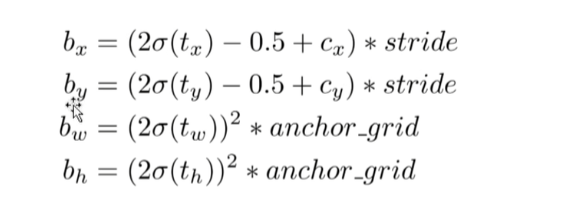

$t_x$为模型预测输出，$b_x$为最终目标检测边框的中心点和宽高的值

$c_x$为当前预测的Tensor对应的grid坐标，值域为$[0,grid_size)$

stride 为[8,16,32]

例子：

输入[416,416,3]，输出为[bs,52,52,3,5+num_classes],$c_x\in[0,52)$,stride=8


anchor_grid同理，值域为[0,image_size),具体为$anchor * stride,anchor \in [0,gridsize)$

之后通过stride放大到原图输入大小

**源代码实现**

```python
if not self.training:  # inference
    if self.onnx_dynamic or self.grid[i].shape[2:4] != x[i].shape[2:4]:
        self.grid[i], self.anchor_grid[i] = self._make_grid(nx, ny, i)

    y = x[i].sigmoid()
    if self.inplace:
        y[..., 0:2] = (y[..., 0:2] * 2 + self.grid[i]) * self.stride[i]  # xy
        y[..., 2:4] = (y[..., 2:4] * 2) ** 2 * self.anchor_grid[i]  # wh
    else:  # for YOLOv5 on AWS Inferentia https://github.com/ultralytics/yolov5/pull/2953
        xy, wh, conf = y.split((2, 2, self.nc + 1), 4)  # y.tensor_split((2, 4, 5), 4)  # torch 1.8.0
        xy = (xy * 2 + self.grid[i]) * self.stride[i]  # xy
        wh = (wh * 2) ** 2 * self.anchor_grid[i]  # wh
        y = torch.cat((xy, wh, conf), 4)
        z.append(y.view(bs, -1, self.no))
```

```python
if self.onnx_dynamic or self.grid[i].shape[2:4] != x[i].shape[2:4]:
    self.grid[i], self.anchor_grid[i] = self._make_grid(nx, ny, i)
```

只在第一次循环的时候求出gird和anchor_grid

**创建anchor和anchor_grid**

```python
def _make_grid(self, nx=20, ny=20, i=0):
    d = self.anchors[i].device
    t = self.anchors[i].dtype
    shape = 1, self.na, ny, nx, 2  # grid shape
    y, x = torch.arange(ny, device=d, dtype=t), torch.arange(nx, device=d, dtype=t)
    if check_version(torch.__version__, '1.10.0'):  # torch>=1.10.0 meshgrid workaround for torch>=0.7 compatibility
        yv, xv = torch.meshgrid(y, x, indexing='ij')
    else:
        yv, xv = torch.meshgrid(y, x)
        grid = torch.stack((xv, yv), 2).expand(shape) - 0.5  # add grid offset, i.e. y = 2.0 * x - 0.5
        anchor_grid = (self.anchors[i] * self.stride[i]).view((1, self.na, 1, 1, 2)).expand(shape)
    return grid, anchor_grid
```

其中先栅格化，得到一张坐标系

anchor_grid先复制一份grid，乘上步长，然后reshape