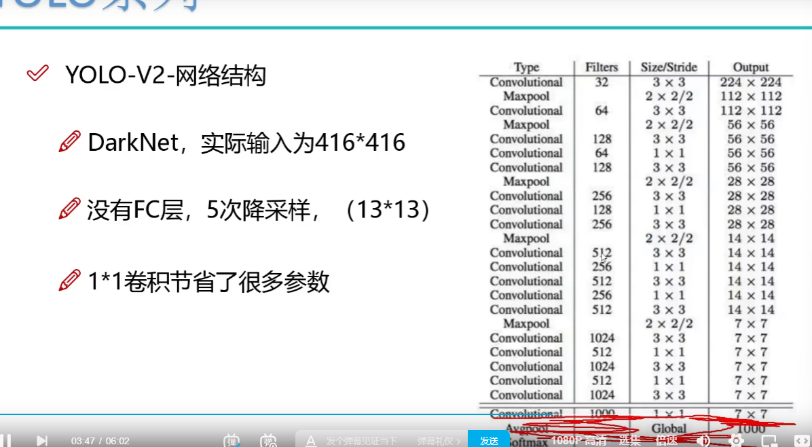
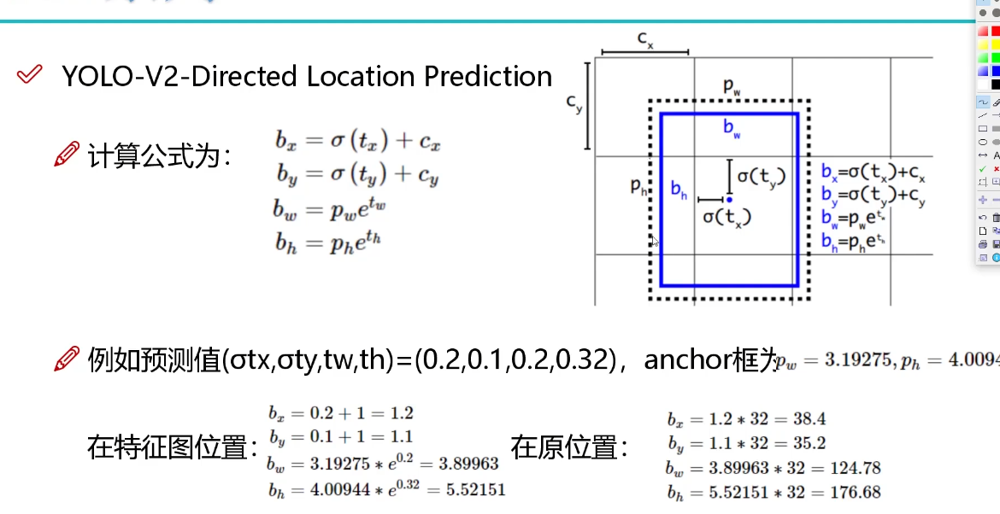
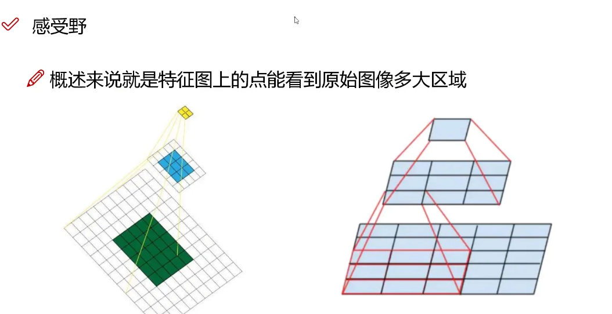
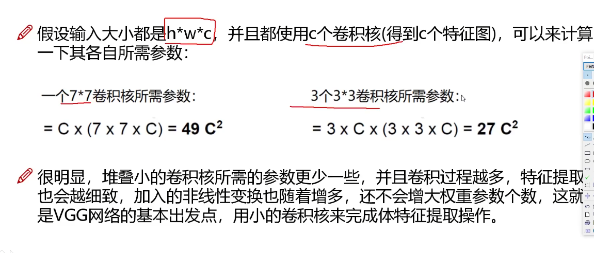
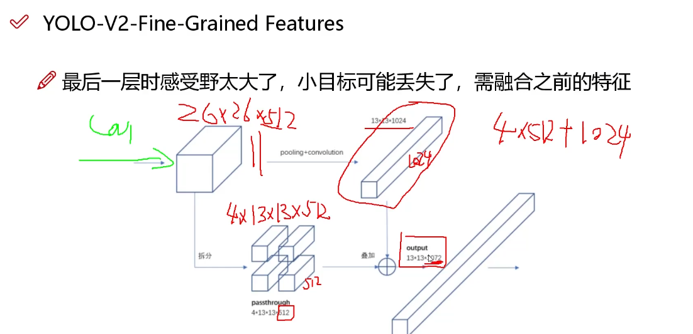

# YOLOv2

- 加入Batch Normalzation
- 舍弃drop out
- 训练时二外进行10次448*448的微调

## 1. 网络结构

- 没有全连接层

- 5次降采样
- 最后输出13*13的矩阵，

## 2. 先验框

在v1中B=2，基于先验框来进行改变

- faster-cnn是使用了9个先验框,但是先验框比例不同
- v2中使用聚类提取先验框(k-means),距离：$d(box,centroids)=1-IOU(box,centroids)$,每个聚类的代表就是我们想要的结果，设置类别多少：5个

**anchor Box**

map值没有提升，但是回归率增大了

**direxted location prediction**

在开始时因为初始数据为随机值，因此x,y,w,h的偏移值会很大，不适合收敛

因此直接预测相对位置而不是绝对位置

同时矩形的长宽也需要等比例缩小：${h/w \over 32}$

注意这里的所有的数值都是等比例缩小的，最后需要等比例放大

## 3. 感受野

最后一次的特征图，的一个像素点，相当于原始输入多大区域。

越大的感受野能感受全面的物体。

****

那么3个`3*3`和1个`7*7`的感受野是一样的，那两者的差别呢

但是如果最有一层感受野太大，小目标就会丢失

如何解决小目标丢失问题，就是接下来的特征融合

## 4. 特征融合

## 5. 多尺度

因为都是卷积，没有全连接层，所以没有尺度限制！！！

