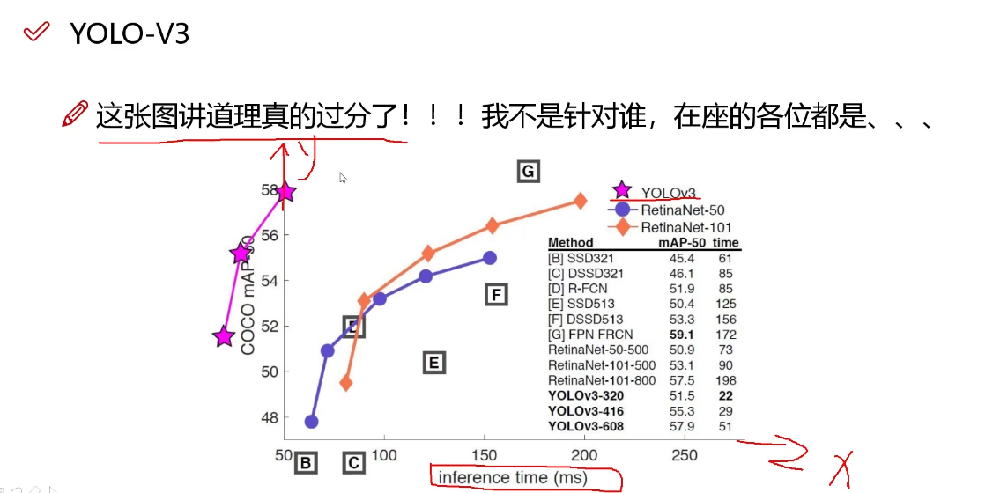
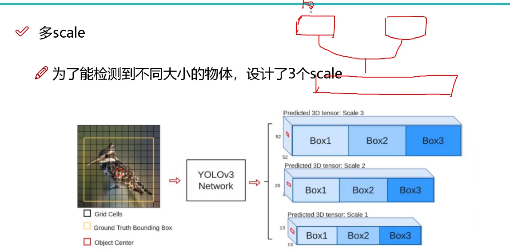
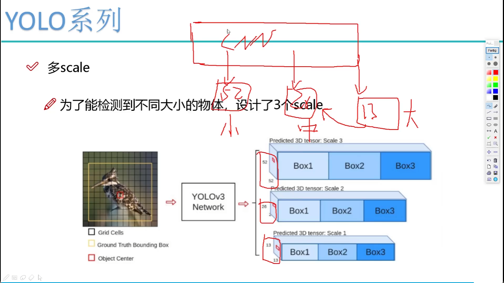
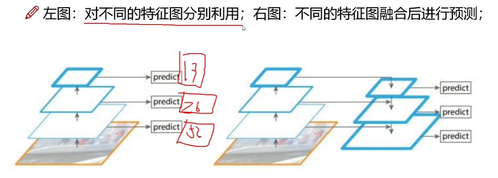
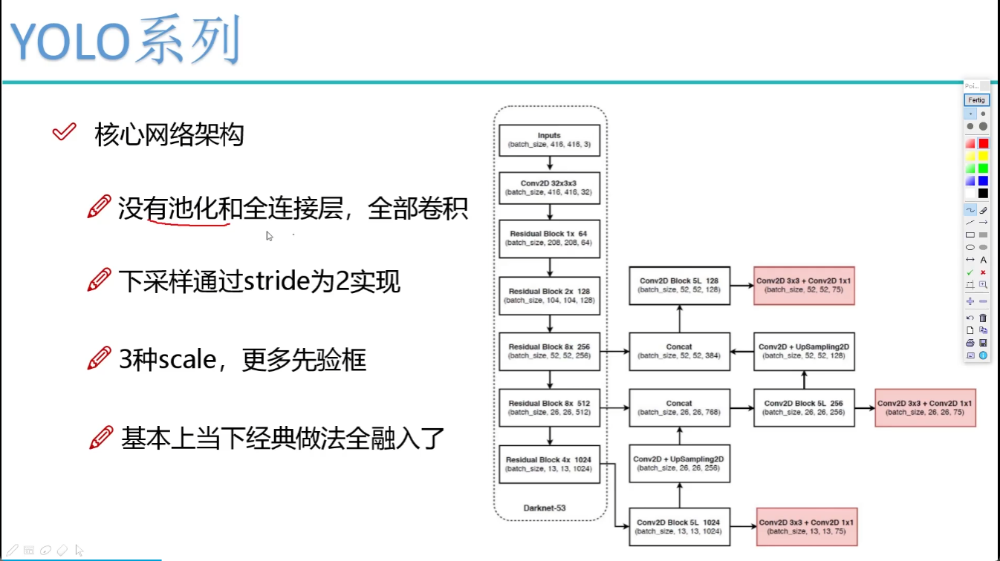
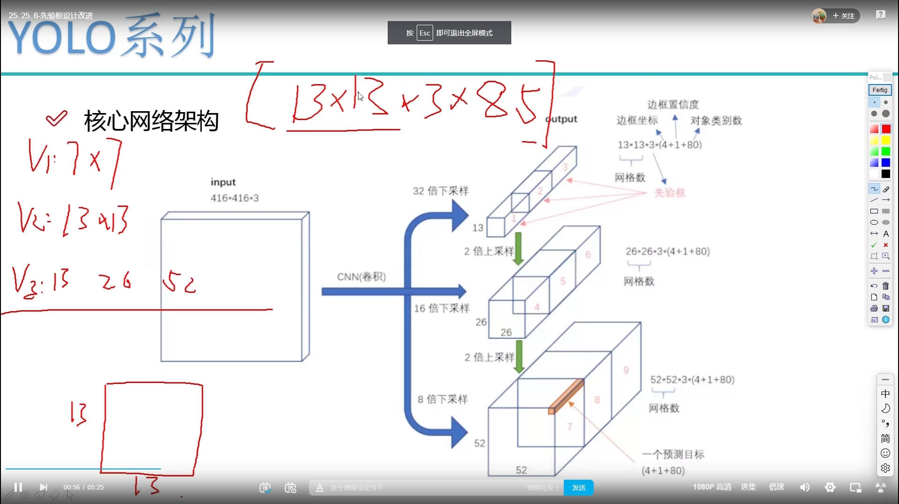
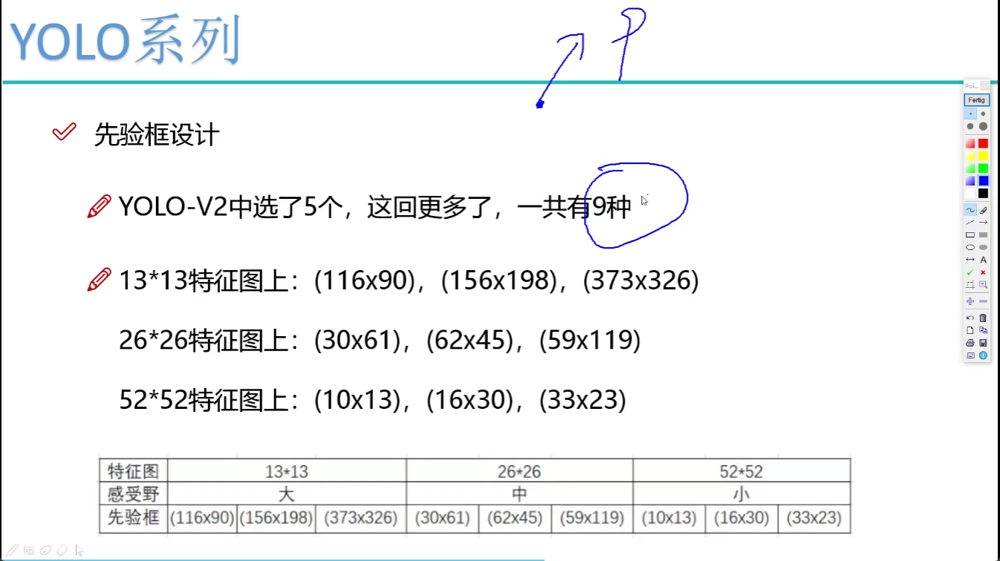
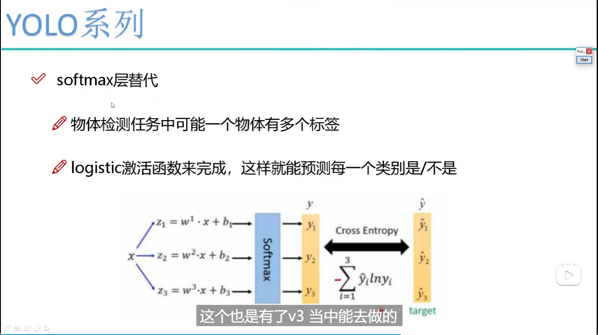

# YOLOv3

- 改变了网络结构，适合小物体检测
- 融入持续特征图信息来预测不同规格物体
- 先验框改进，一共9种
- softmax改进

## 1. 多scale

为了检测到不同大小的物体，设计了3个scale

感受野大的预测大的物体，一次类推

> 感受野小的会借鉴感受野大的
>
> 

## 2. scale变换经典方法

- 图像金字塔--速度慢
- 单一的输出
- 对不同的特征图分别利用
- 不同的特征图融合后进行预测

## 3. 残差连接和网络结构

## 4. 先验框

## 5. softmax替代

一个物体可能有多种标签

