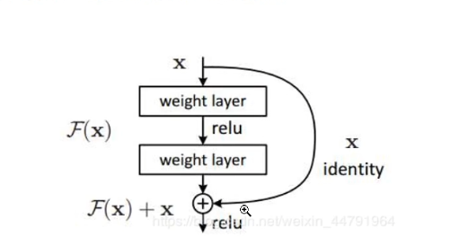
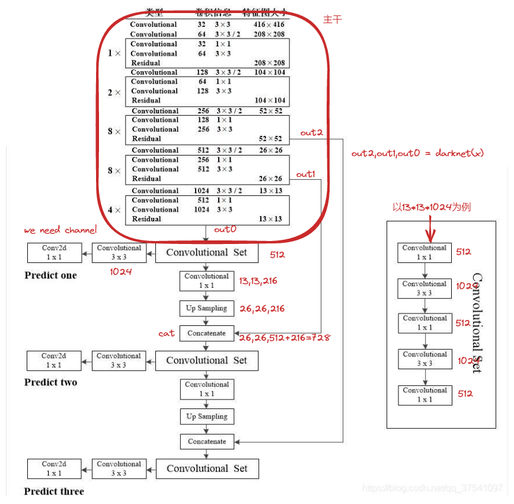

# YOLOv3

总体思路

https://blog.csdn.net/weixin_44791964/article/details/105310627

特征提取架构

- 输入图片`batch 416  416 3`
- 输出图片有三种
  - `52 52 256`
  - `26 26 512`
  - `13 13 1024`
- `[13,13,1024]==>[13,13,75]`   `75 = 3 *(20+5)`

注：原文中种类数为80，这个可以酌情修改！！

- 每种输出的特征图会进行上采样并向上堆叠

## 1. 网络的架构

**残差网络**

结构如图，作用：让这一层的交过不会更差，只会更好

