# YOLOv1

https://www.bilibili.com/video/BV15w411Z7LG

经典数据集

- PASCAL-VOC07
- ILSVRC
- MS-COCO
- Open Images

分类

- 单阶段
- 双阶段

## 1. 预测阶段--向前推断

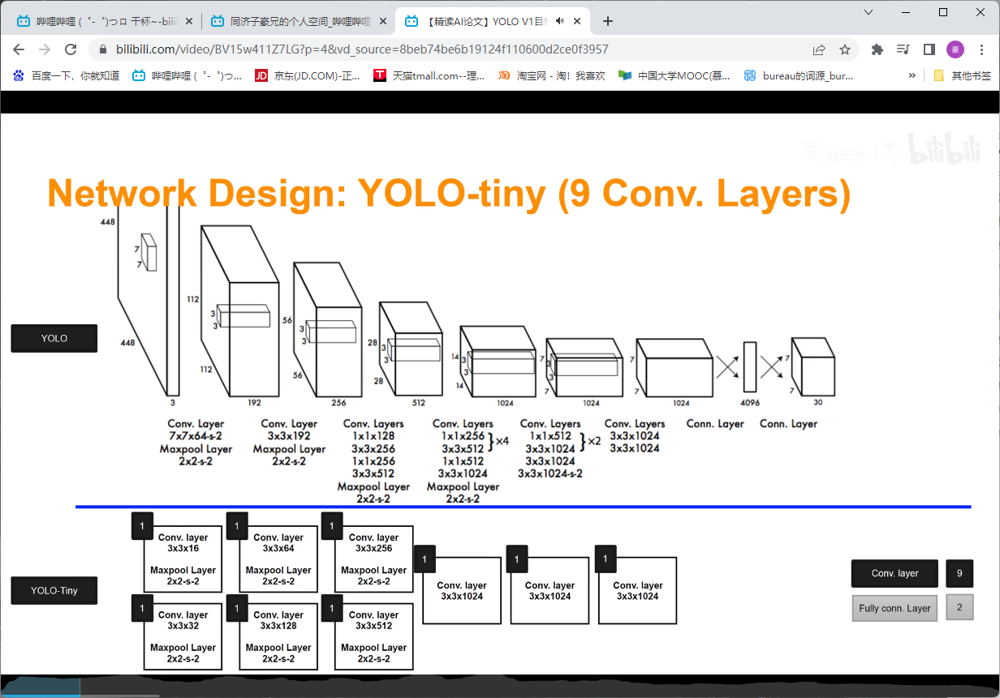

- `7*7*30`的原因

- 将图像划分为7*7=49个网格，每个grid cell预测B=2个预测框
- 每个bounding box有5个属性(x,y,h,w,c)-c为是否为物体的置信度
- `30 = 5*2+20`20为分类情况

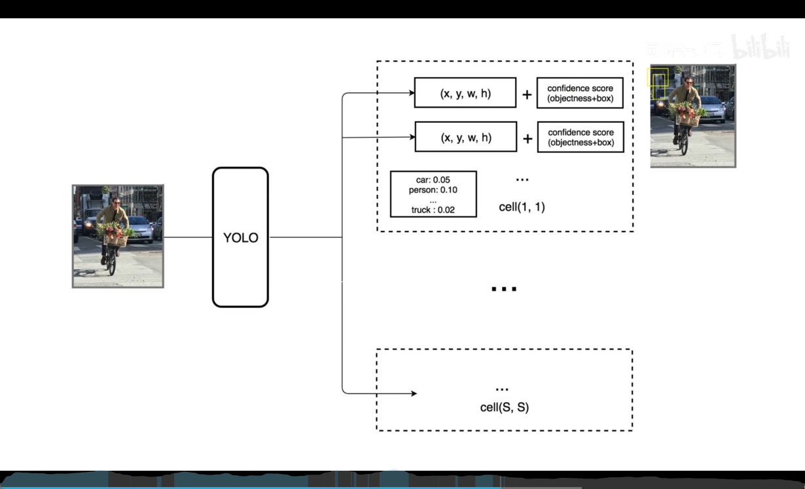

- 置信度较高的框用粗线表示，较低的框用细线表示
- 无论怎么样都可以预测`7*7*2=98`个框
- 也可以预测每个框的条件概率

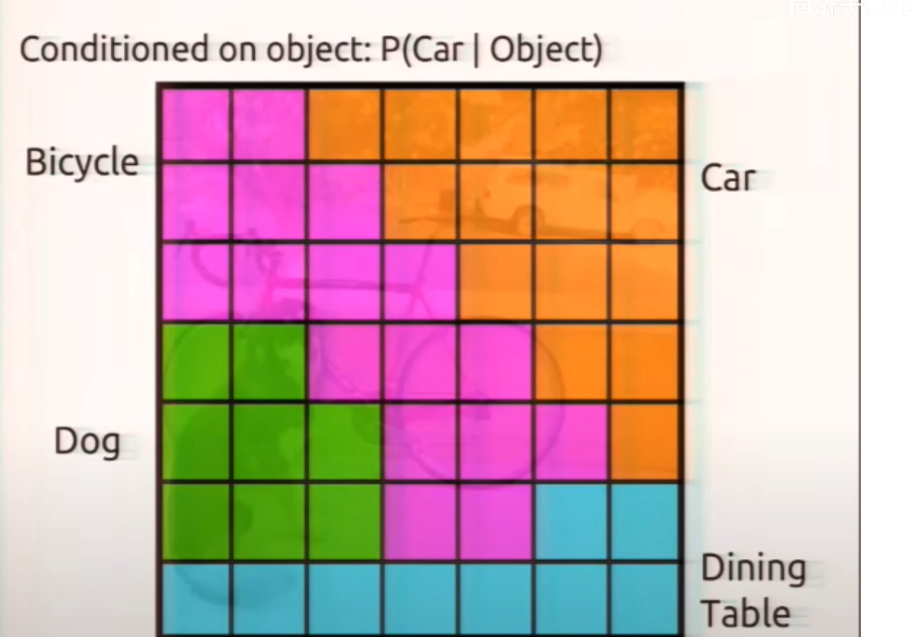

- 之后经过后处理就得到如下结果

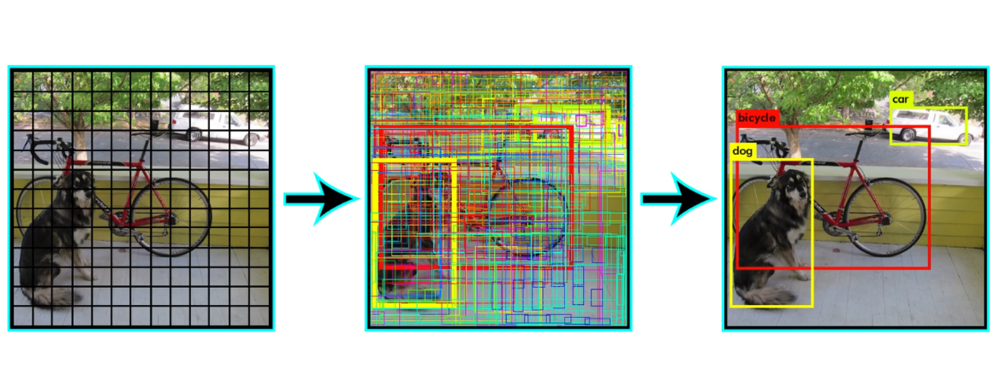

## 2. 预测阶段后处理

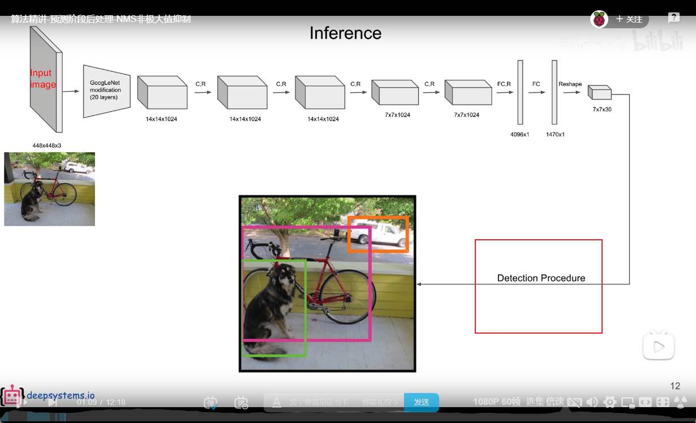

- 如何得到特定物体的概率

拿出分类概率和置信度，将两者相乘就得到了一个bbox的预测

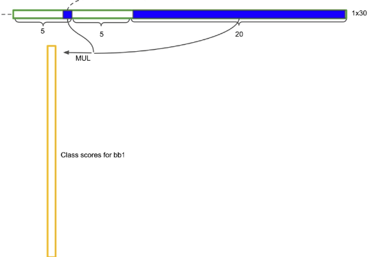

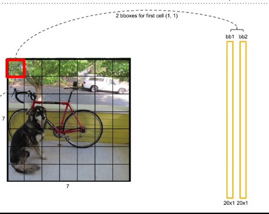

那么总共就有98个bbox

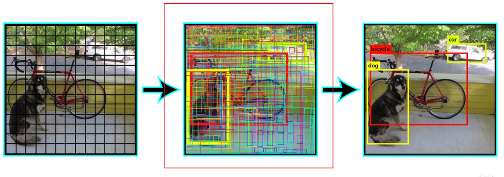

以狗为例

- 设置一个阈值将较小值置零
- 以狗这一类进行排序
- 进行非极大值抑制

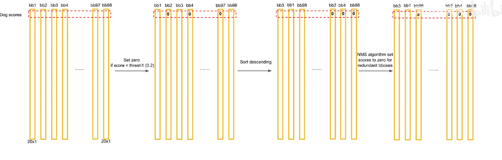

### 非极大值抑制

- 选出值最大的
- 将最大的和其他的进行比较
- 计算IOU如果IOU大于某个值那么就是重复预测
- 过滤了低概率的

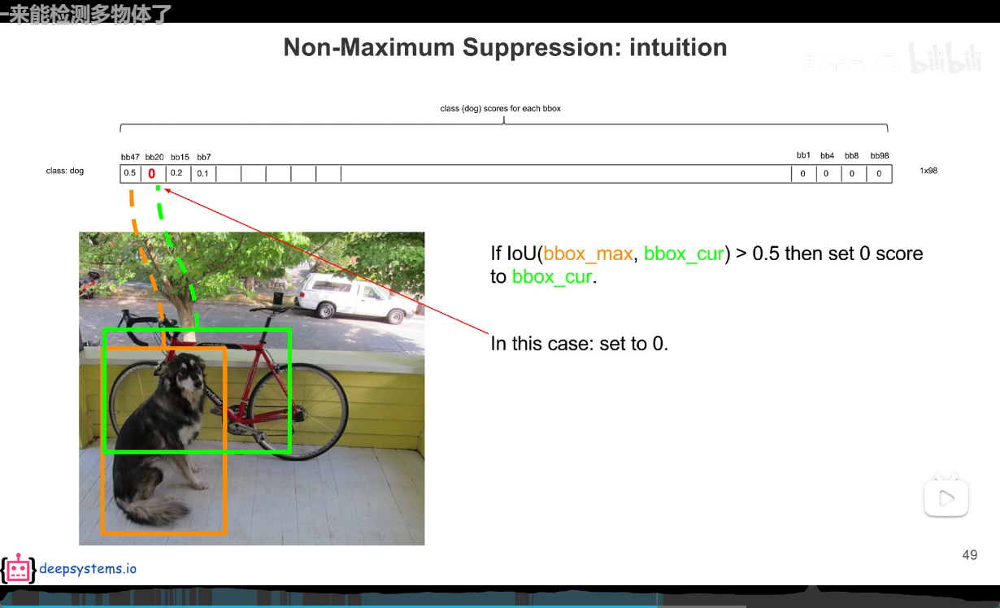

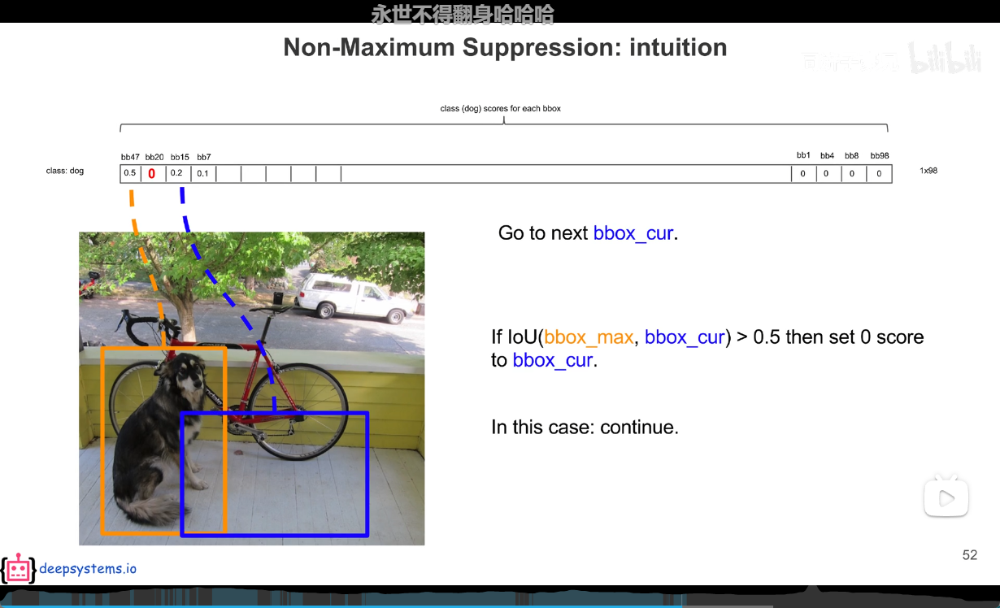

- 剔除最大的，以第二大的重复之前的操作

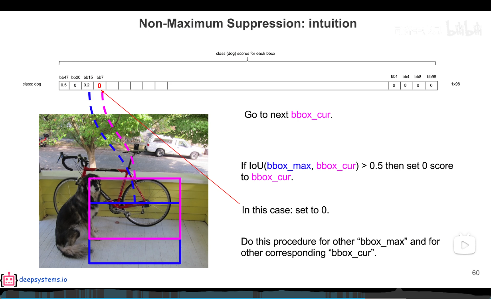

之后进行可视化

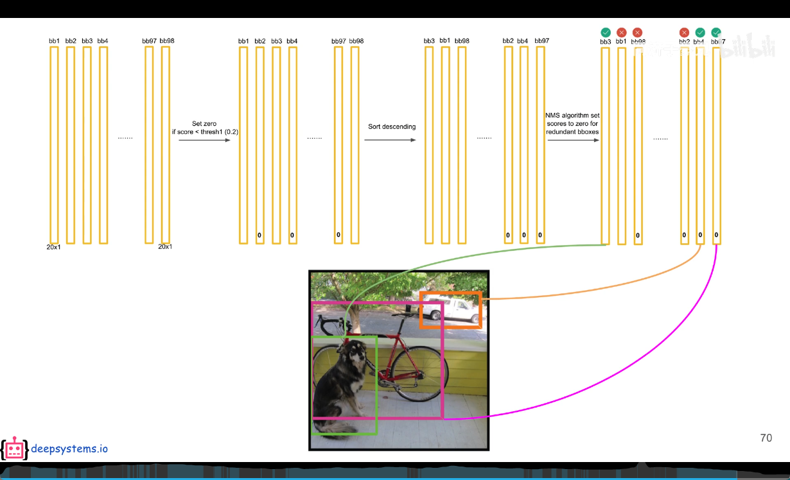

- 训练阶段不需要进行后处理！！！！

## 3. 训练阶段（反向传播）

训练之前，我们需要人工的画出框，并且每个cell的类别应该也是物体的类别！！，算法就是要去尽量的拟合框

由内一个bounding box进行拟合呢，肯定就是IOU较大的那个进行拟合，另一个框什么都不需要做

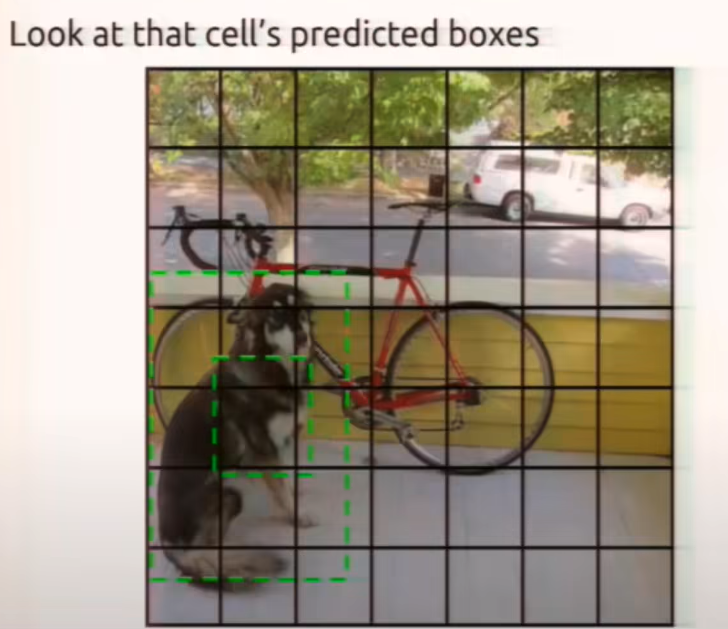

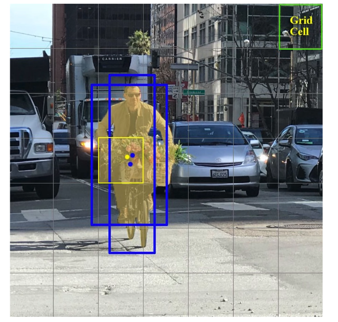

如果没有标注框的中心点不在cell中，那么这部分只需要将置信度尽可能低就好

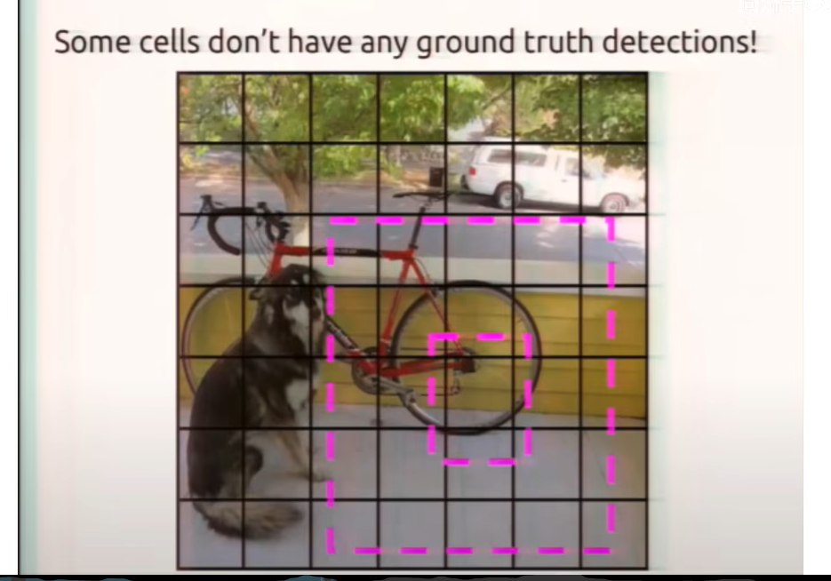

### 损失函数

 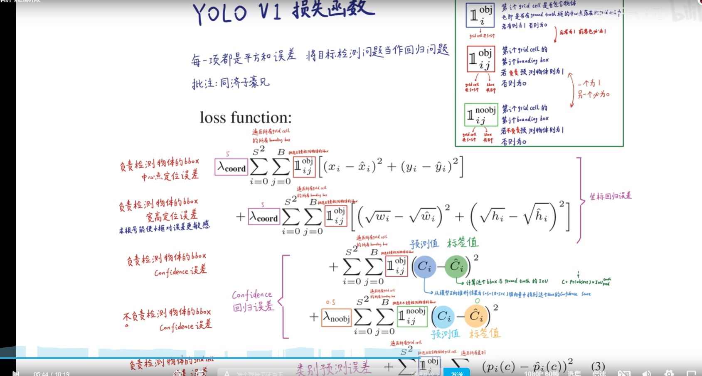

## 4. 一些细节

论文精讲

https://www.bilibili.com/video/BV15w411Z7LG
