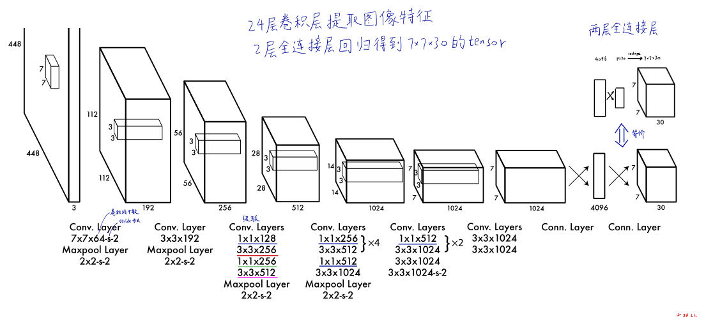
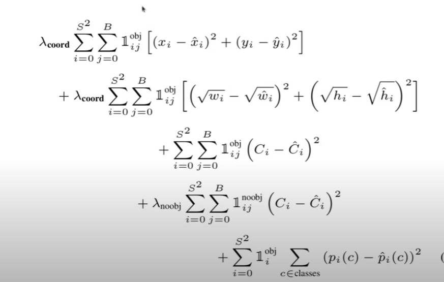

# 实战

文件目录

```
model.py
loss.py
model.py
train.py
utills.py
```

模型结构



### model.py

```python
import torch
import torch.nn as nn

model_config = [
    # kernel_size output_size stride padding
    (7, 64, 2, 3),
    "M",
    (3, 192, 1, 1),
    "M",
    (1, 128, 1, 0),
    (3, 256, 1, 1),
    (1, 256, 1, 0),
    (3, 512, 1, 1),
    "M",
    [(1, 256, 1, 0), (3, 512, 1, 1), 4],
    (1, 512, 1, 0),
    (3, 1024, 1, 1),
    "M",
    [(1, 512, 1, 0), (3, 1024, 1, 1), 2],
    (3, 1024, 1, 1),
    (3, 1024, 2, 1),
    (3, 1024, 1, 1),
    (3, 1024, 1, 1),
]


class CNNBlock(nn.Module):
    def __init__(self, in_channels, out_channels, **kwargs):
        super(CNNBlock, self).__init__()
        self.conv = nn.Conv2d(in_channels, out_channels, bias=False, **kwargs)
        self.batchnorm = nn.BatchNorm2d(out_channels)
        self.leakyrelu = nn.LeakyReLU(0.1)

    def forward(self, x):
        x = self.conv(x)
        x = self.batchnorm(x)
        x = self.leakyrelu(x)
        return x


class Yolov1(nn.Module):
    def __init__(self, in_channels=3, **kwargs):
        super(Yolov1, self).__init__()
        self.model_config = model_config
        self.in_channels = in_channels
        self.darknet = self._create_conv_layers(self.model_config)
        self.fcs = self._create_fcs(**kwargs)

    def forward(self, x):
        x = self.darknet(x)
        x = torch.flatten(x, start_dim=1)
        x = self.fcs(x)
        return x
        # Flattens input by reshaping it into a one-dimensional tensor.
        # start=也就是说按照那招第一维度进行reshape

    def _create_conv_layers(self, architecture):
        layers = []
        in_channels = self.in_channels

        for item in architecture:
            if type(item) == tuple:
                layers += [CNNBlock(
                    in_channels, item[1], kernel_size=item[0],
                    stride=item[2], padding=item[3])]
                in_channels = item[1]
            elif type(item) == str:
                layers += [nn.MaxPool2d(kernel_size=2,stride=2)]
            elif type(item) == list:
                conv1 = item[0]
                conv2 = item[1]
                num_repeat = item[2] 
                
                for _ in range(num_repeat):
                    layers+=[
                        CNNBlock(
                        in_channels, conv1[1], kernel_size=conv1[0],
                        stride=conv1[2], padding=conv1[3]),
                        CNNBlock(
                        conv1[1], conv2[1], kernel_size=conv2[0],
                        stride=conv2[2], padding=conv2[3]),
                        ]
                    in_channels = conv2[1]
        
        return nn.Sequential(*layers)
    
    def _create_fcs(self,split_size,num_boxes,num_classes):
        S,B,C = split_size,num_boxes,num_classes
        return nn.Sequential(
            nn.Flatten(),
            nn.Linear(1024*S*S,496),#缩短时间---origin paper:4096
            nn.Dropout(0.0),
            nn.LeakyReLU(0.1),
            nn.Linear(496,S*S*(C+B*5)),#origin 7*7*(5*2+20)因为用不到那么多的类别所以缩小了参数!!!
            #感觉主要是思想符合就可以，细节可以微调
        )
        
def test(S = 7 , B = 2 , C=20):
    model = Yolov1(split_size = S,num_boxes=B,num_classes=C)
    x = torch.randn((2,3,448,448))
    print(model)
    out = model(x)
    print(out.shape)
    
```

可能是外国人比较喜欢**kwargs

还有就是需要多看看除了模型意外，图片的预处理等细节方面的需要多看看

## 2. loss.py



注意中间的标志只会是0或者1，这个需要我们自己写函数判断！！！

判断标注是IOU

```python
import torch
from torch import nn, set_default_dtype
from utils import intersection_over_union

class YoloLoss(nn.Module):
    def __init__(self , S = 7 ,B = 2,C = 20):
        super(YoloLoss,self).__init__()
        self.mse = nn.MSELoss(reduction="sum")
        self.S = S 
        self.B = B
        self.C = C
        self.lambda_noobj = 0.5#就是置信度的那个
        self.lambda_coord = 5#就是用来测定长宽和位置的那个
        
    def forward(self, predictions, targets):
        predictions = torch.reshape(predictions,(-1,self.S,self.S,self.C+self.B*5))
        # predictions.rshape(-1,self.S,self.S,self.C+self.B*5)
        #iou的计算
        iou_b1 = intersection_over_union(predictions[..., 21:25], targets[..., 21:25])
        iou_b2 = intersection_over_union(predictions[..., 26:30], targets[..., 21:25])
        ious = torch.cat([iou_b1.unsqueeze(0), iou_b2.unsqueeze(0)], dim=0)
        #unsqueeze将tensor变为一行，之后按照行进行组合
        iou_maxes , best_box = torch.max(ious,dim=0)
        exists_box = targets[...,20].unsqueeze(3)#obji的置信度
        # ===========================
        # for box coordinates
        # ===========================
        box_predictions = exists_box * ( 
            (best_box*predictions[...,26:30]+
            (1-best_box)*predictions[...,21:25])
        )
        box_targets = exists_box * targets[...,21:25]
        #1e-6是为了增加稳定性, sign函数返回其+1 ， -1 也就是说返回原本的正负号！！！
        box_predictions[...,2:4] = torch.sign(box_predictions[...,2:4])  *torch.sqrt(
            torch.abs(box_predictions[...,2:4]+1e-6))
        #(N,S,S,4)
        box_targets[...,2:4] = torch.sqrt(box_targets[...,2:4])
        #(N,S,S,4)==>*(N*S*S,4)
        box_loss = self.mse(
            torch.flatten(box_predictions,end_dim=-2),
            torch.flatten(box_targets,end_dim=-2)
        )
        

        
        # ===========================
        # for object loss
        # ===========================
        
        pred_box = (
            best_box*predictions[...,25:26]+(1-best_box) * predictions[...,20:21]
        )
        
        #(N*S*S,1)
        object_loss = self.mse(
            torch.flatten(exists_box*pred_box),
            torch.flatten(exists_box*targets[...,20:21])       
        )
        # ===========================
        # for no object loss
        # ===========================
            
        no_object_loss = self.mse(
            torch.flatten((1-exists_box)*predictions[...,20:21],start_dim=1),
            torch.flatten((1-exists_box)*targets[...,20:21],start_dim=1)
        )
        no_object_loss += self.mse(
            torch.flatten((1-exists_box)*predictions[...,25:26],start_dim=1),
            torch.flatten((1-exists_box)*targets[...,20:21],start_dim=1)
        )
            
        # ===========================
        # for class loss
        # ===========================
        
        class_loss = self.mse(
            torch.flatten(exists_box*predictions[...,:20],end_dim=-2),
            torch.flatten(exists_box*targets[...,:20],end_dim=-2)
        )
        
        loss = (
            self.lambda_coord*box_loss
            + object_loss
            + self.lambda_noobj*no_object_loss
            + class_loss
        )
        return loss

```

之后进行详细分析

## 3. dataset部分


