# YOLOv3

## 1. 网络结构

- 解决了小目标的问题

- 骨干网络darknet-53

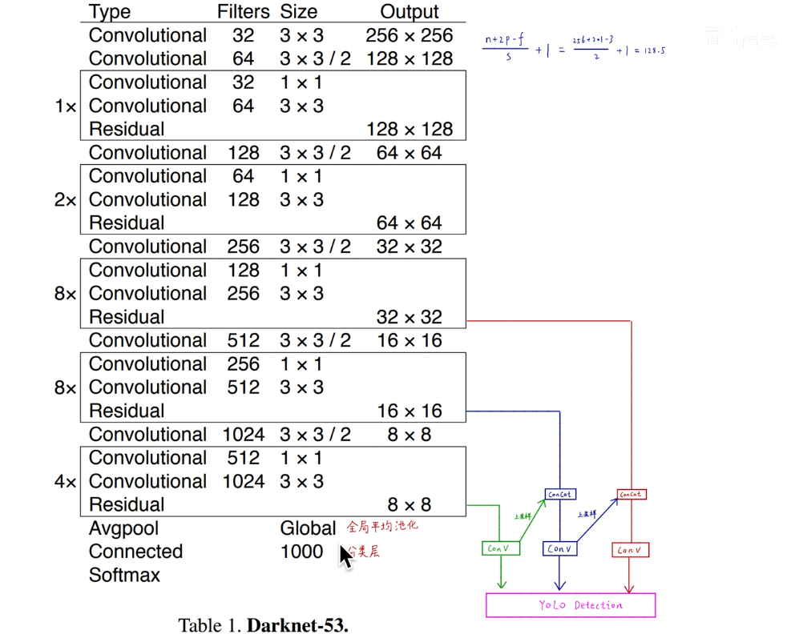

residual:残差连接

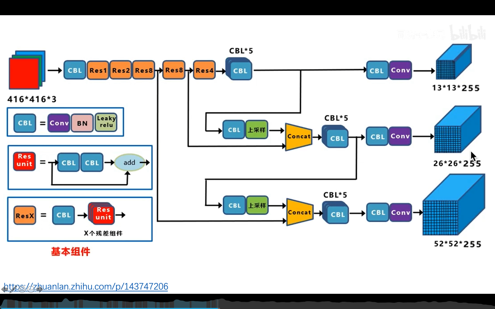

`255 = 3*(5+80)` 

3种anchor，x,y,w,h,obj,五个数据类型，80种分类

三种不同情况对应三种不同的感受野

- concat 操作：直接堆叠特征图

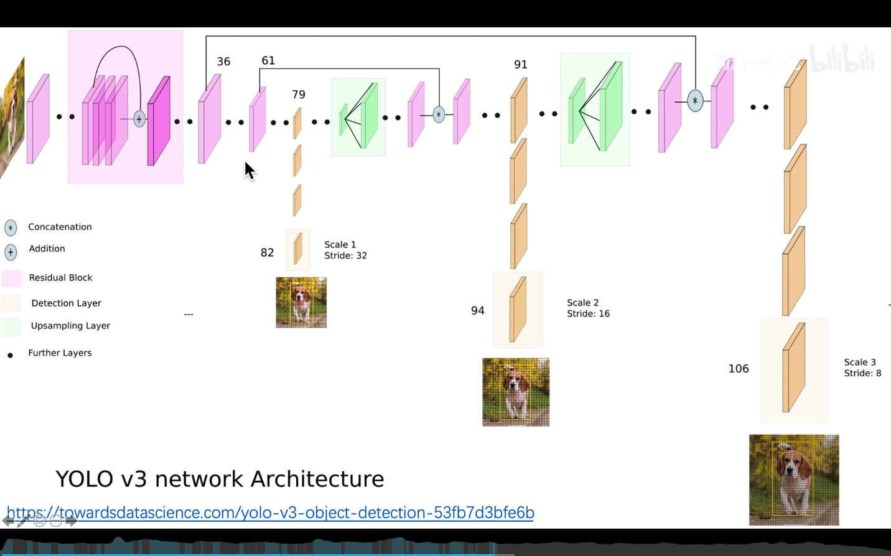

如何resize

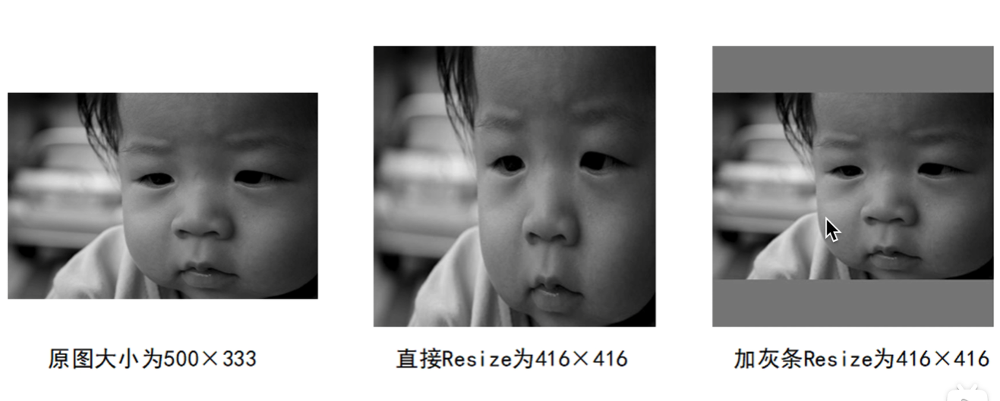

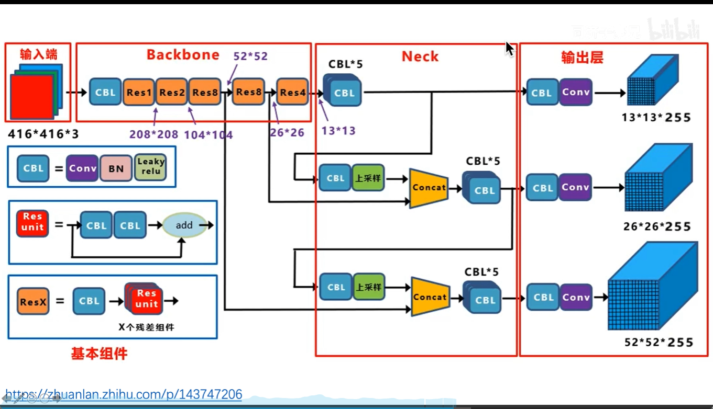

使用了不同的输出大小，对应预测不同大小的物体

因为loss种会判断IOU阈值，只有合适的anchor才会去预测对应的物体

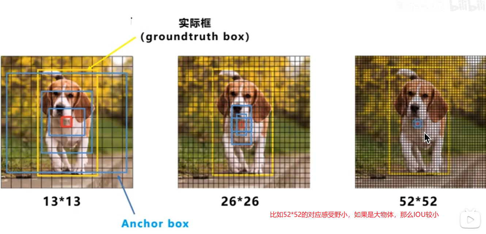

因为有三种尺度所以不再根据实际框的中心点来选择anchor，而是根据anchor种IOU最大的来选择

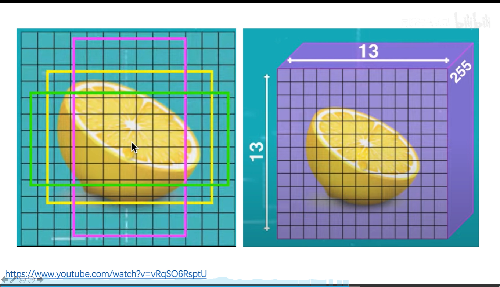

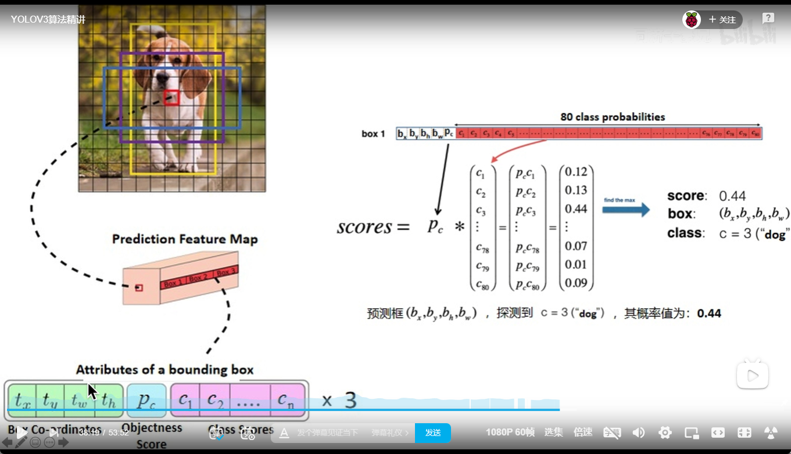

就比如这只狗，实际标注的中心点落在红色，那么就由那个cell来预测，由哪个anchor来，根据IOU

输入的size大小不同，但是需要是32的倍数，不同大小最后三个输出的大小也不一样

## 2. 损失函数

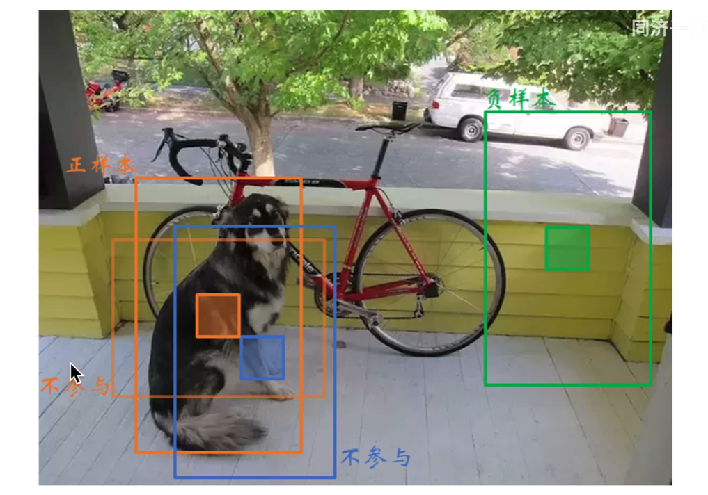

样本分为三部分

- 正样本：IOU最大的
- 不参与：IOU大于阈值，但不是最大的
- 负样本：IOU低于阈值

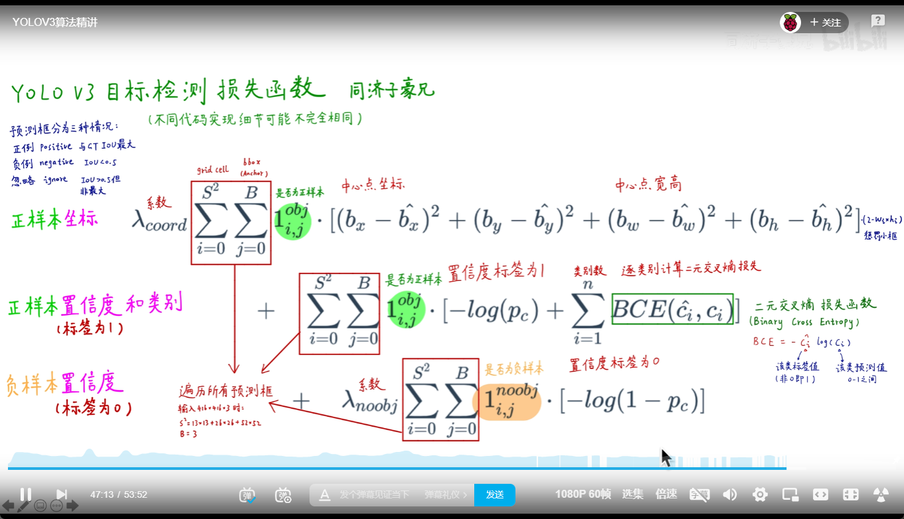

  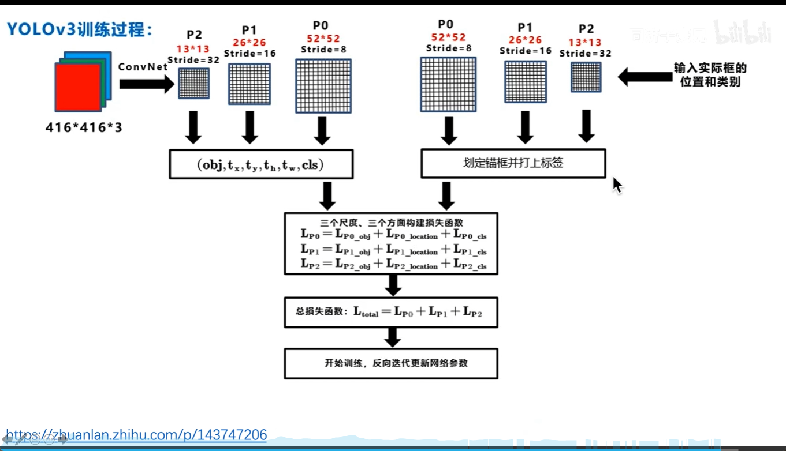

损失函数最后直接相加，最后一期反向出阿伯

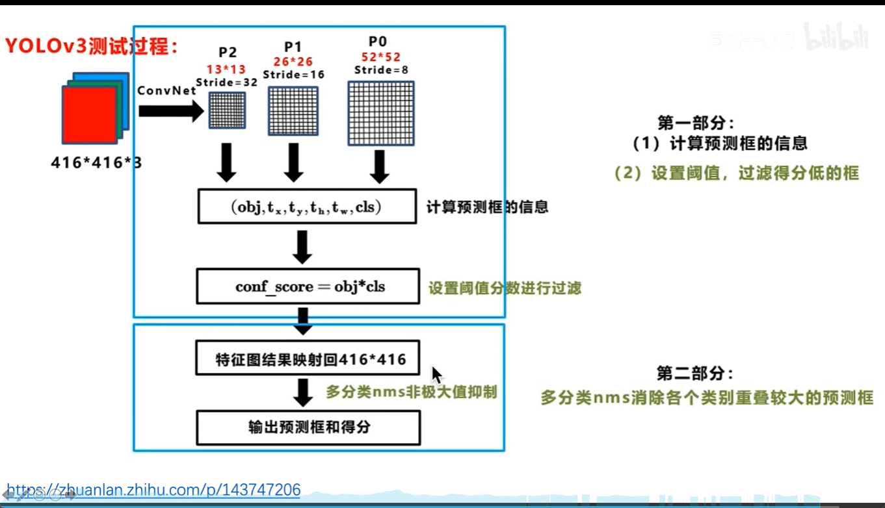

> 推荐代码阅读
>
> ultralytics/yolov3
>
> qqwweee/keras-yolo3

## 3. yolov3改进

1. 密集连接
2. 空间金字塔

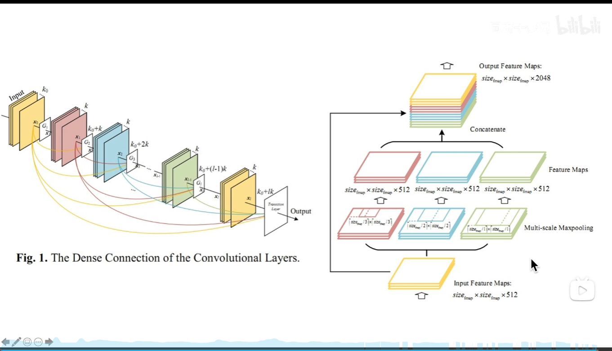

## 4. 论文精读

https://www.bilibili.com/video/BV1Vg411V7bJ?p=2&vd_source=8beb74be6b19124f110600d2ce0f3957

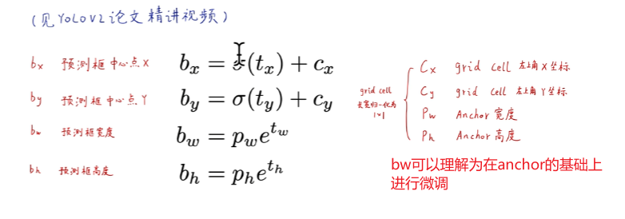

置信度使用logistic regression，通过置信度最大的anchor来拟合，他的置信度为1，如果直接使用IOU作为置信度标签不行

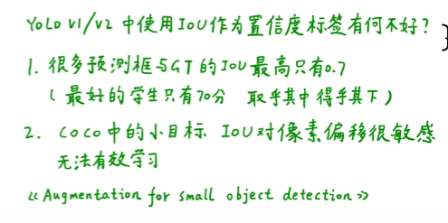

**正负样本**

- 正样本：对分类和定位学习产生贡献
- 负样本：对置信度学习产生贡献，不对定位产生贡献

**种类预测**

不适用softmax，使用独立的逻辑回归，在训练的时候使用二分类交叉熵损失函数，每个分类独立的使用逻辑回归，那么结果就是，由很多类别同时有较高的分数（每一个类别独立计算！！）

**预测框的数量**

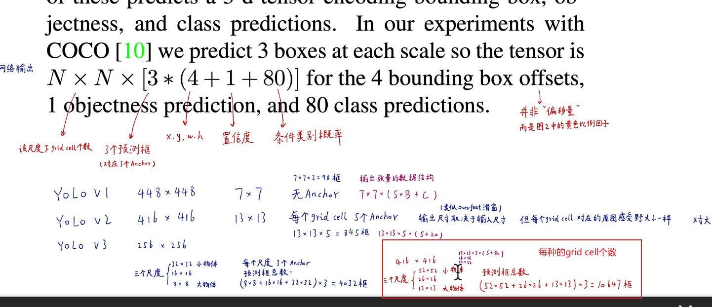

**anchor的尺度**

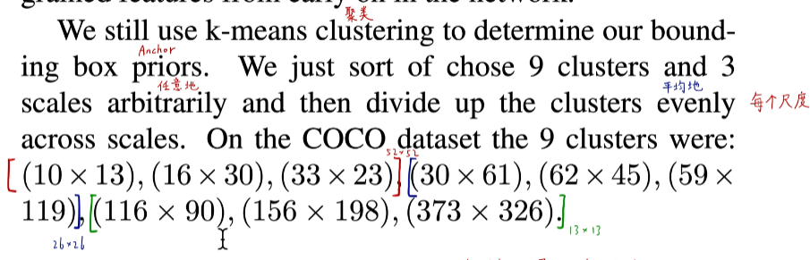

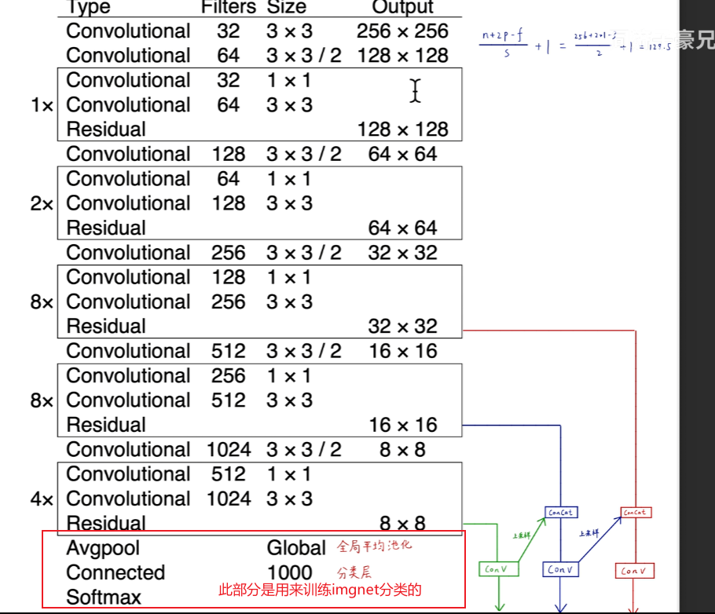

下面部分在目标检测训练的时候是不使用的

YOLOv3在精准定位的时候不太行

会增加一个惩罚小框的项

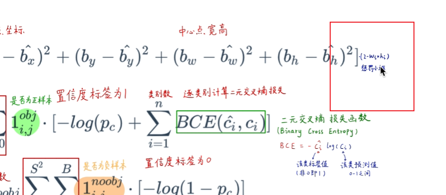

**一些试了但是没啥用的项**

- 使用anchor的x,y的倍数作为偏移量
- 直接使用线性回归不使用sigmod
- docal loss
- 双IOU阈值---不缺正样本，但是却高质量的负样本！！！（感觉可以单独设置负样本，因为我们标注的话，只会标注正样本，但是不会去标注负样本这就导致有些图片种，可以作为正样本的地方作为了负样本，可能产生影响！！）（可不可以设置-1，1这样）

- YOLOv3在高阈值的情况下的时候精度不高
